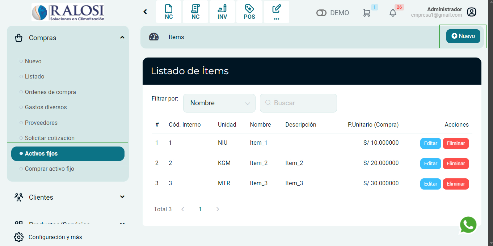

# Activos fijos

En esta área te ayudaremos a ingresar tus activos fijos y tenerlos registrados. Sigue estos pasos para realizarlo:

Ingresa al módulo de **Compras** y luego selecciona **Activos fijos** seguidamente la subcategoría **Ítems**.

## Generar nuevo ítem

En la parte superior derecha, selecciona el botón **Nuevo**.

Visualizará el siguiente formulario, proceda a completar los siguientes campos.

**1. Nombre:** Ingresa el nombre del activo fijo.

**2. Tipo de afectación:** Por defecto se selecciona Gravado- Operación Onerosa en caso de que utilice un tipo de afectación de IGV distinto, puede seleccionarlo.

:::danger IMPORTANTE:

Consulte con su contador si tiene dudas sobre que tipo de afectación deberá utilizar.

:::

**3. Descripción:** Ingresa una pequeña descripción.

**4. Unidad:**  Selecciona las unidades que se amolden a su activo fijo.

**5. Código Interno:** Ingresa el código interno.

**6. Precio Unitario (Compra):** Ingresa el precio unitario de compra.

**7. Moneda:** Selecciona el tipo de moneda en la que se realizo la compra.

Finalmente selecciona el botón **Guardar**, seguidamente podrá visualizar el **Listado de Ítems**.
