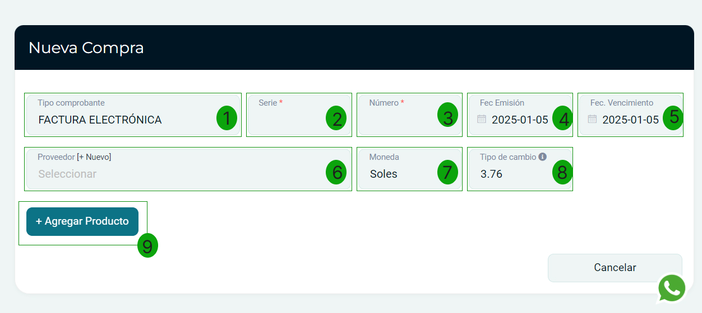
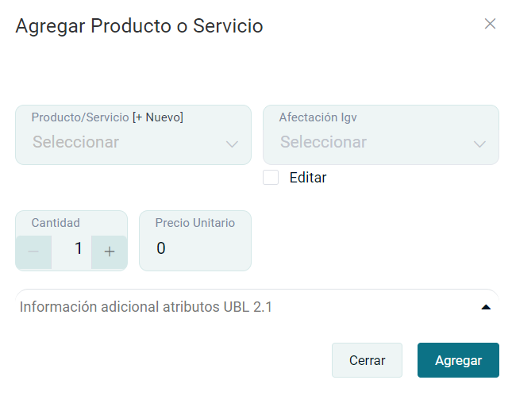

# Comprar activo fijo

En esta área te ayudaremos a ingresar tus activos fijos de compras. Sigue estos pasos para realizarlo:

Ingresa al módulo de **Compras**, luego selecciona **Activos fijos**, posteriormente la subcategoría Compras.

## Generar nueva compra

En la parte superior derecha selecciona el botón **Nuevo.**

Visualizará el siguiente formulario, proceda a completar los siguientes campos.

1. **Tipo de comprobante:** Selecciona el tipo de comprobante.

2. **Serie:** Ingresa la serie del comprobante.

3. **Número:** Ingresa el número del comprobante.

4. **Fec. Emisión:** Ingresa la fecha de emisión del comprobante.

5. **Fec. Vencimiento:** Ingresa la fecha de vencimiento del comprobante.

6. **Proveedor:** Selecciona el proveedor para la creación del comprobante, si no está creado, podrá realizarlo paso a paso en este [artículo].

7. **Moneda:** Selecciona el tipo de moneda en la que se realizo la compra.

8. **Tipo de cambio:** Este campo viene rellenado por defecto según los datos de la SUNAT.

9. **Agregar Producto:** Al seleccionar este botón se abrirá una ventana de Agregar Producto o Servicio.

- **Producto/Servicio:** Selecciona el producto o servicio de los activos fijos, si no está creado, podrá realizarlo paso a paso en este artículo.
- **Afectación Igv:** Por defecto se selecciona Gravado- Operación Onerosa en caso de que utilice un tipo de afectación de IGV distinto, puede seleccionarlo.
- **Cantidad:** Ingresa la cantidad del producto o servicio.
- **Precio Unitario:** Ingresa el precio unitario.

:::danger IMPORTANTE:

Consulte con su contador si tiene dudas sobre que tipo de afectación deberá utilizar.

:::

Luego presione el botón **Agregar**, observará los productos añadidos en el comprobante.

Finalmente presione el botón **Generar**. Podrá dirigirse al listado o a una nueva compra.
