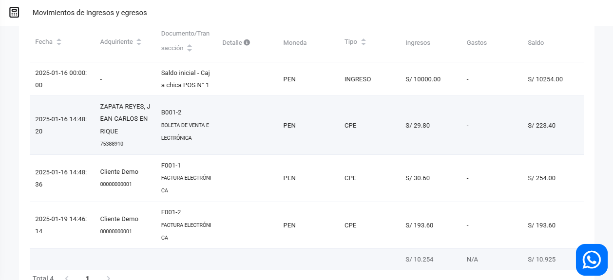

# Movimientos

En este artículo te mostraremos como revisar los movimientos de ingresos y egresos. En esta sección podrá observar la unión de todas las cajas chicas creadas por cada usuario. Sigue estos pasos para realizarlo:

Ingresa al módulo de **Finanzas** y selecciona la subcategoría **Movimientos**.

## Filtros de búsqueda

Puede filtrar los ingresos y egresos que visualizará con los siguientes filtros:

- **Periodo**
- **Mes**
- **Casilla de selección:** Última apertura de caja : Al seleccionar esta casilla observará todas las cajas iniciando en la fecha que se abrió en la última caja de los usuarios.

Seguido seleccione el botón **Buscar**. Observará el detallado de sus ingresos y egresos que se realizaron con efectivo, de la misma manera seleccionando el botón **Exportar Excel** puede descargar los datos en un archivo excel.

:::danger IMPORTANTE:
Solo se visualizaran los movimientos que se realizaron con efectivo.
:::
