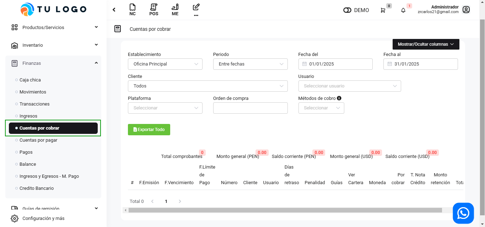
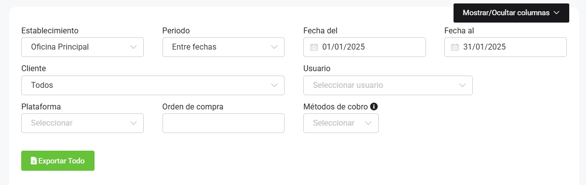
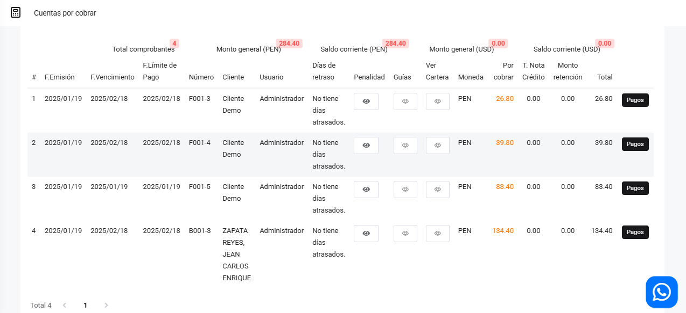

# Cuentas por cobrar

En este artículo te te mostraremos como revisar tus cuentas por cobrar. Sigue estos pasos para realizarlo:

Ingresa al módulo de **Finanzas** y luego selecciona la subcategoría **Cuentas por cobrar**.

Podrá observar todas los comprobantes electrónicos que están pendientes por cobrar. Completa los siguientes filtros:

Podrá exportar los reportes, seleccionando el botón correspondiente.

:::danger IMPORTANTE:
Solo selecciona los filtros que requieras.
:::

Se observan las siguientes cuentas pendientes:

Al seleccionar el botón **Pagos**:

Al seleccionar el botón **Nuevo**, podrá agregar pagos, una vez pagada toda la deuda, se eliminará la factura de la lista de cuentas por cobrar.
