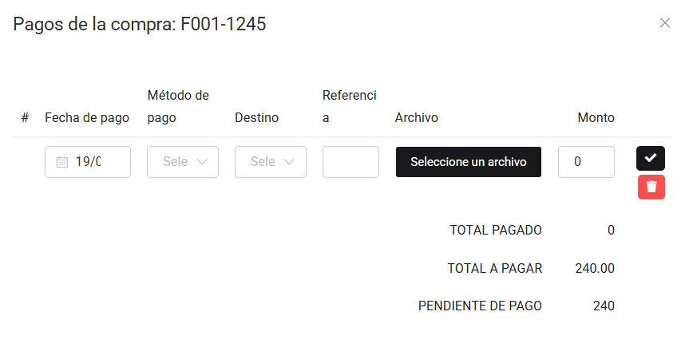

# Cuentas por pagar

En este artículo te te mostraremos como revisar tus cuentas por pagar. Sigue estos pasos para realizarlo:

Ingresa al módulo de **Finanzas** y luego selecciona la subcategoría **Cuentas por pagar**.

Podrá observar todas los comprobantes electrónicos que están pendientes por pagar. Completa los siguientes filtros:

:::danger IMPORTANTE:
Solo selecciona los filtros que requieras.
:::

Podrá exportar los reportes, seleccionando el botón correspondiente.

Luego seleccione el botón **Buscar**. Se observan las siguientes cuentas por pagar:

Al seleccionar el botón Pagos:

Al seleccionar el botón **Nuevo**, podrá agregar pagos, una vez pagada toda la deuda, se eliminará la factura de la lista de cuentas por pagar.
