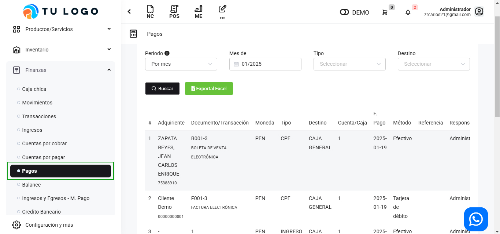
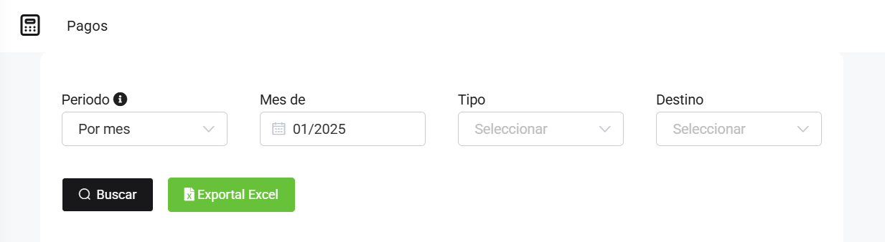
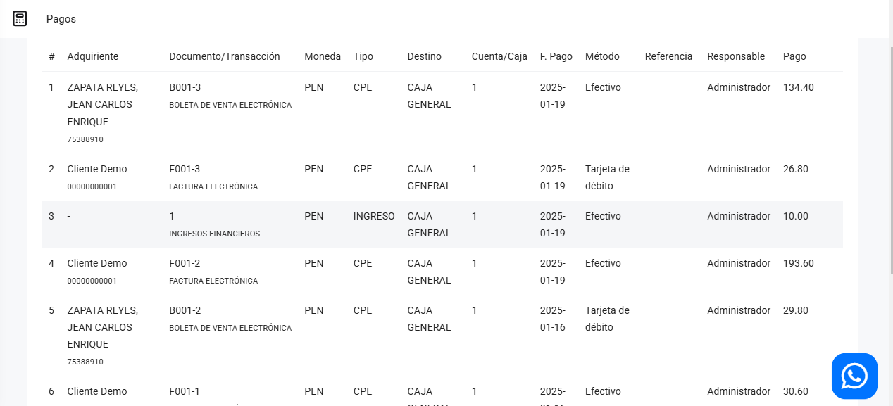

# Pagos

En este artículo te mostraremos como revisar los movimientos de ingresos y egresos de una manera más detallada. En esta sección podrá observar quien realizo los pagos. Sigue estos pasos para realizarlo:

Ingresa al módulo de **Finanzas** y selecciona la subcategoría **Pagos**.

Completa los siguientes filtros:

:::danger IMPORTANTE:
Selecciona solo los filtros necesarios.
:::
Podrá exportar los reportes, seleccionando el botón correspondiente.

Luego seleccione el botón **Buscar**. Se observan los siguientes movimientos:

