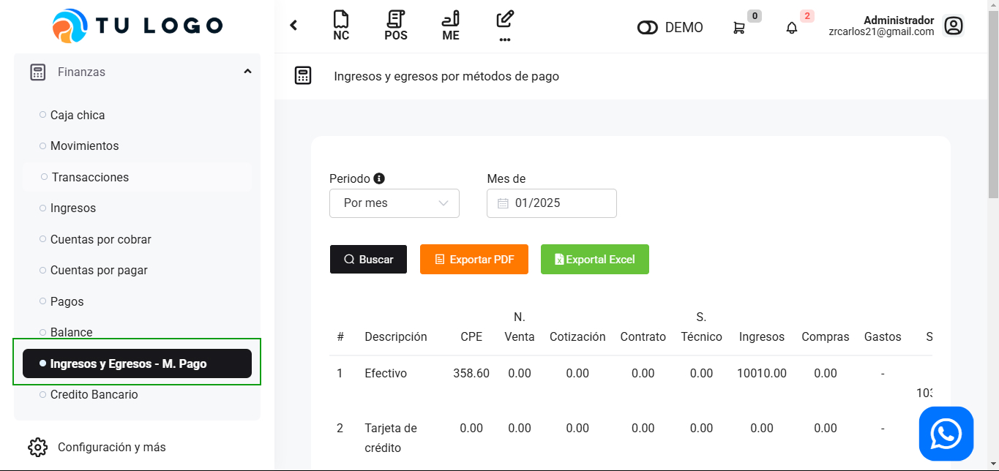
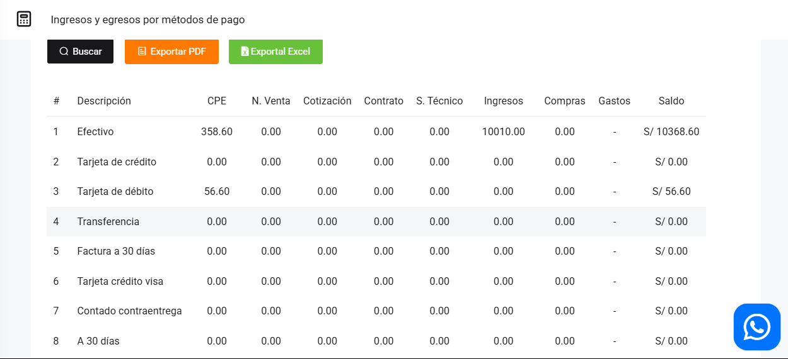

# Ingresos y egresos por métodos de pago

En este artículo te te mostraremos como revisar tus Ingresos y egresos por métodos de pago. Sigue estos pasos para realizarlo:

Ingresa al módulo de **Finanzas** y luego selecciona la subcategoría **Ingresos y Egresos - M.Pago**.

Podrá observar todas los ingresos y egresos detallando de como se pago, el método que utilizo para pagar. Tendrá que completar los filtros :

Podrá exportar los reportes, seleccionando el botón correspondiente.

Luego seleccione el botón Buscar. Se observan los movimientos:

