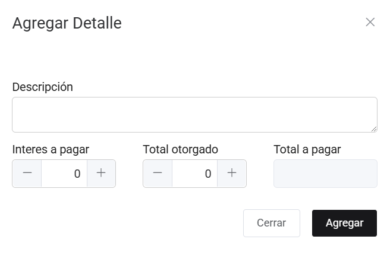
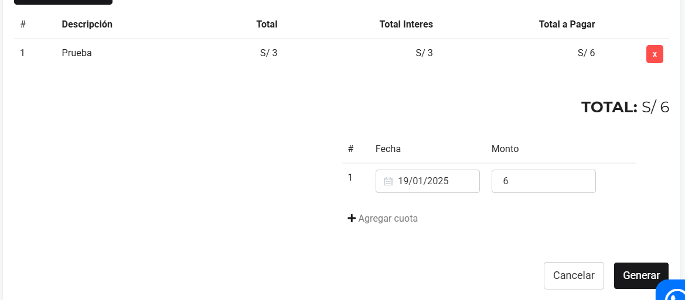
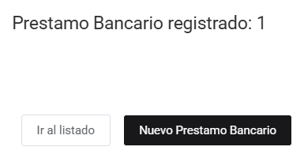

# Crédito bancario

En esta área te ayudaremos a crear los registros de préstamos bancarios que tu empresa ha solicitado, asimismo esto te permitirá mantener un orden contable. Sigue estos pasos:

Ingresa al módulo de **Finanzas** y luego selecciona la subcategoría **Crédito Bancario**.

## Crear préstamo bancario

Selecciona el botón **Nuevo** que está en la parte superior derecha de la página.

Se encontrará el formulario de nuevo préstamo bancario y se completarán los siguientes datos.

**1. Datos de cuenta bancaria**
Se deben añadir los siguientes campos:

- **Cuenta:** Seleccion el número de cuenta bancario con el que se tiene el prestamo a registrar.
- **Tipo de comprobante:** Selecciona préstamo.
- **Número:** Ingresa el número de identificación del registro bancario.
- **Moneda:** Selecciona el tipo de moneda en dólares americanos o Soles.
- **Tipo de cambio:** Es el tipo de cambio del día, extraído de SUNAT.
- **Fec Emisión:** Es el tipo de cambio del día, extraído de SUNAT.

**2. Agregar Detalle**
Posteriormente selecciona el botón Agregar detalle y encontrará el formulario de Agregar detalle.

Se procederá a ingresar los siguientes datos:

- **Descripción:** Ingresa algun detalle que describa el registro.
- **Interés a pagar:** Ingresa el interés del préstamo.
- **Total otorgado:** Ingresa el total del préstamo.
- **Total:** Es la suma del interés más el total otorgado.

Después selecciona el botón Agregar, donde visualizará la descripción del nuevo préstamo bancario.

Asimismo, también puedes Agregar más cuotas seleccionando el botón **[+Agregar cuota]**.

Posteriormente procede a seleccionar el botón **Generar** y se creará el registro del préstamo bancario.

Por consiguiente, aparecerá una ventana del registro completado, donde tendrá la opción de **Ir al Listado** o generar un **Nuevo préstamo bancario**.

Finalmente para observar la lista de registro del préstamo bancario, nos ubicamos nuevamente en listado.

Contaremos con las siguientes opciones o botones:

- **Pagos:** Registra los pagos de las cuotas mensuales.
- **Editar:** Permite editar el registro del préstamo bancario.
- **Eliminar:** Permite editar el registro del préstamo bancario.
