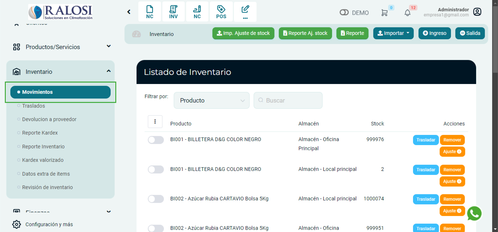
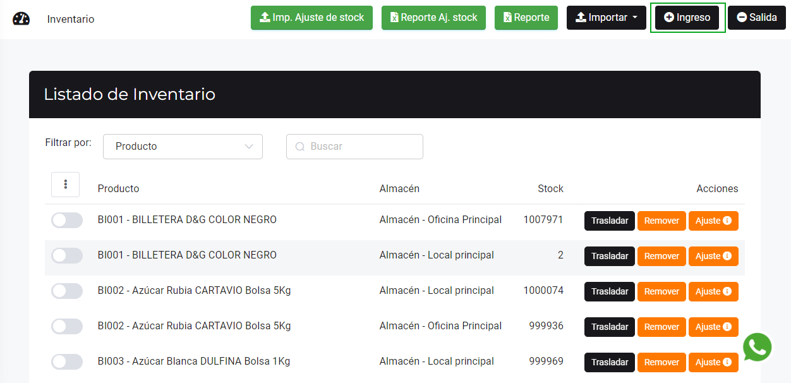
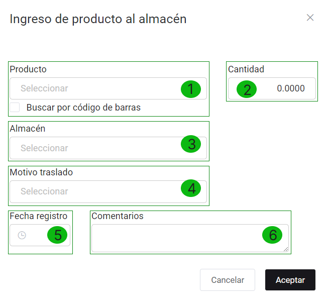
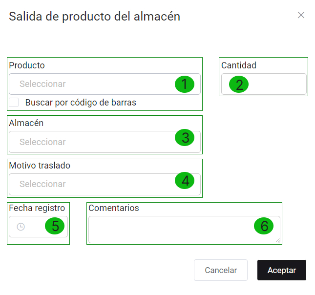
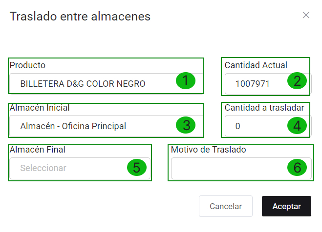
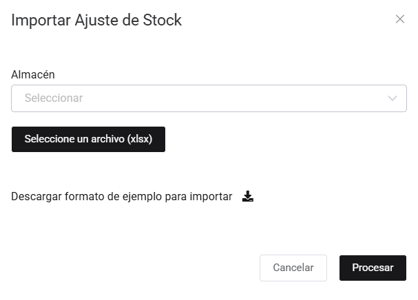
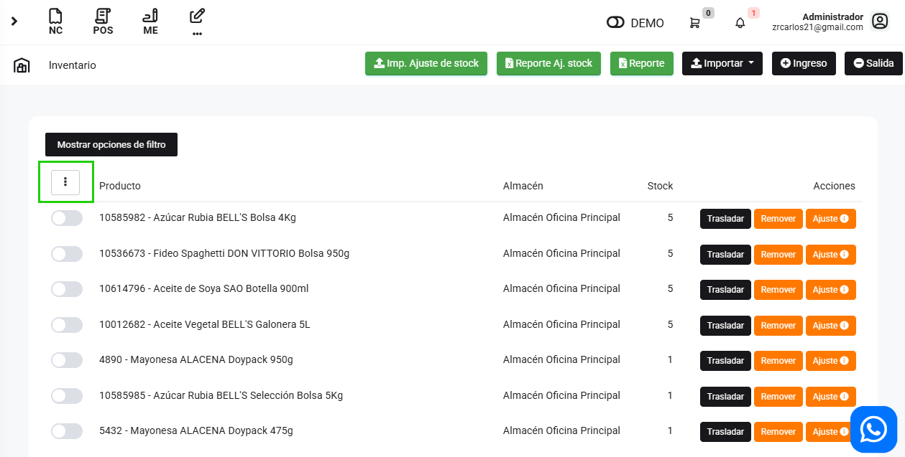

# Movimientos

En esta área te ayudaremos a utilizar los diferentes botones dentro del **Listado de Inventario**. Sigue estos pasos para realizarlo:

Ingresa al módulo de **Inventario**, luego selecciona la subcategoría **Movimientos.**

## Botón ingreso

Este botón registra el ingreso de producto al almacén.

Al seleccionar este botón aparecerá un pequeño formulario para llenar los datos de Ingreso de producto al almacén.

Se completarán los siguientes datos:

* **Producto (*):** Selecciona el producto que desea ingresar.
* **Cantidad (*):** Ingresa la cantidad que desea ingresar.
* **Almacén (*):** Selecciona el almacén en donde el producto ingresará.
* **Motivo traslado (*):** Selecciona el motivo de ingreso del producto que más le convenga.
* **Fecha registro:** Selecciona la fecha de registro.
* **Comentarios:** Ingresa comentarios si es que tuviera.
  
Seguidamente selecciona el botón **Aceptar**, para guardar los cambios.

## Botón salida

Este botón registra la salida de producto del almacén.

Al seleccionar este botón aparecerá un pequeño formulario para llenar los datos de **Salida de producto del almacén.**

Se completarán los siguientes datos:

* **Producto (*):** Selecciona el producto que desea registrar salida.
* **Cantidad (*):** Ingresa la cantidad que desea registrar salida.
* **Almacén (*):** Selecciona el almacén de donde el producto saldrá.
* **Motivo traslado (*):** Selecciona el motivo de la salida del producto que más le convenga.
* **Fecha registro:** Selecciona la fecha de salida.
* **Comentarios:** Ingresa comentarios si es que tuviera.

:::danger IMPORTANTE:
Todos los campos que cuentan con **(*)** son obligatorios.
:::
## Botón trasladar

Este botón se utiliza para mover producto entre almacenes.

Al seleccionar este botón aparecerá un pequeño formulario para llenar los datos de **Traslado entre almacenes.**

Los datos se autocompletan según el producto que se seleccionó.

Los siguientes datos se deben completar de manera obligatoria:

* **Cantidad a trasladar:** Ingresa la cantidad de producto que desea trasladar al otro almacén.
* **Almacén final:** Selecciona el almacén a donde se trasladará el producto.
  
## Botón remover

Este botón es similar al **botón salida**, la diferencia es que en este botón no te pide el motivo de la salida del producto.

Al seleccionar este botón aparecerá un pequeño formulario para llenar los datos de **Retirar producto de almacén**

Los datos se autocompletan según el producto que se selecciono.

El campo que debe completar es:

* **Cantidad a retirar:** Ingresa la cantidad de producto que retirará del almacén.
  
## Botón ajuste

Este botón te ayuda a ajustar tu stock, en caso de que el stock del sistema no cuadre con el stock actual.

Al seleccionar este botón aparecerá un pequeño formulario para llenar los datos de **Ajuste de stock.**

Los datos se autocompletan según el producto que se selecciono.

El campo que debe completar es:

* **Stock real:** Ingresa el stock actual.

:::danger IMPORTANTE:

El botón **Ajuste** no aplica para productos con lotes y series.
:::
## Botón Imp. Ajuste de stock

Este botón te ayuda a importar masivamente el ajuste de stock.

Al seleccionar este botón aparecerá un pequeño formulario para llenar los datos de **Importar Ajuste de stock.**

Primero selecciona el almacén en el que se modificará el stock. Después selecciona el botón **Descargar formato de ejemplo para importar** , se descargará un archivo excel.

En el documento se completará:

* **Código interno:** Ingresa el código interno del producto.
* **Stock real:** Ingresa el stock real del producto.
  
Una vez rellenado el archivo excel, deberá seleccionar el botón **Seleccione un archivo (xlsx)** ,para subir el archivo correspondiente.

## Tres puntos

Para seleccionar todos los productos de la fila

