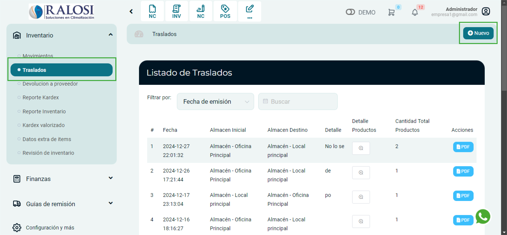

# Traslados

En esta área te ayudaremos a trasladar productos de manera grupal de un almacén a otro. Sigue estos pasos para realizarlo:

Ingresa al módulo de **Inventario** , luego selecciona la subcategoría **Traslados**. En la parte superior derecha selecciona el botón **Nuevo**.

## Nuevo traslado
Posteriormente aparecerá el formulario para llenar los datos del Documento de devolución

Se completarán los siguientes datos:

**1.  Almacén Inicial:** Selecciona el almacén de donde se sacarán los productos.

**2.  Almacén Final:** Selecciona el almacén de donde llegarán los productos.

**3.  Motivo de Traslado:** Ingresa el motivo de traslado.

**4.  Producto: Selecciona** los productos a trasladar.

**5.  Cantidad actual:** Este campo se autocompleta una vez seleccionado el producto.

**6.  Cantidad a trasladar:** Ingresa la cantidad que desea trasladar.

**7.  Agregar producto:** Selecciona el botón para agregar el producto.

Una vez rellenado, selecciona el botón **Guardar**. Aparecerá la lista de traslados.
