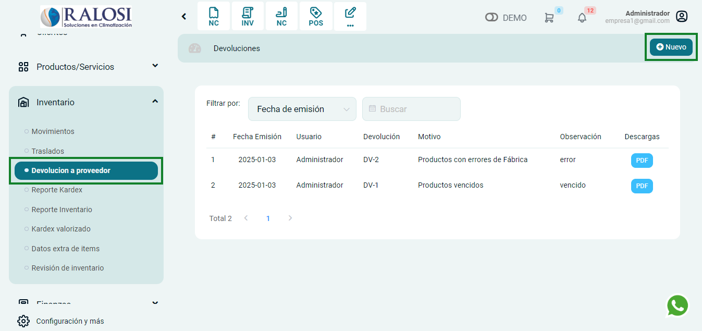
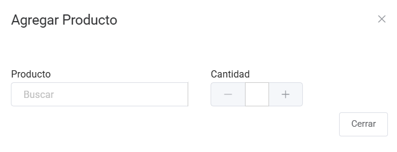

# Devolución a Proveedor

En esta área te ayudaremos a registrar devoluciones a tus proveedores. Sigue estos pasos para realizarlo:

Ingresa al módulo de **Inventario**, luego selecciona la subcategoría **Devolución a proveedor**. En la parte superior derecha selecciona el botón **Nuevo**.

## Documento de devolución

Posteriormente aparecerá el formulario para llenar los datos del Documento de devolución.

Se completarán los siguientes datos:

1. **Motivo:** Selecciona el motivo de la devolución.

2. **Fec. Emisión:** Ingresa la fecha de emisión.

3. **Observación:** Ingresa la observación.

4. **Agregar producto:** Selecciona el botón para agregar productos.

## Agregar producto

Posteriormente aparecerá una ventana de **Agregar producto.**

* **Producto:** Ingresa el producto al que se realizará el cambio.
* **Cantidad:** Ingresa la cantidad del producto.
Posteriormente selecciona el botón **Guardar.**
