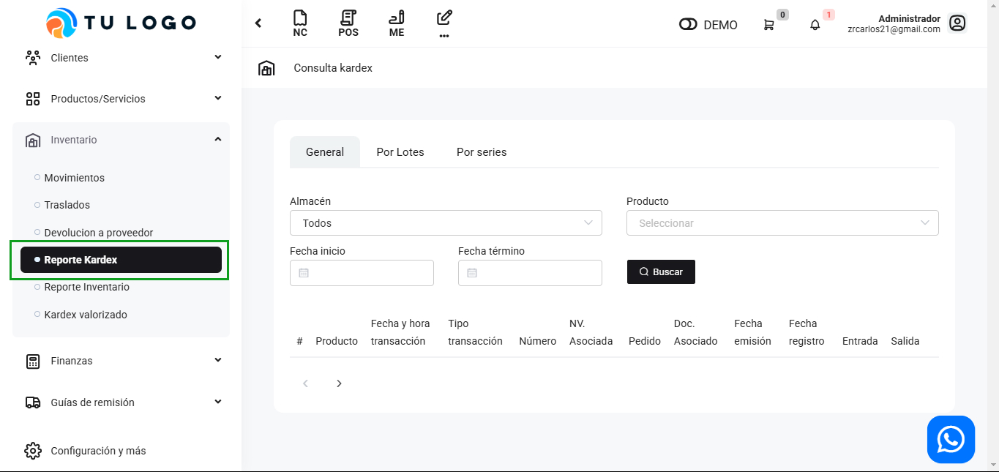

# Reporte Kardex

En esta área te ayudaremos a revisar el reporte organizado kardex que muestra el movimiento **(ingresos, salidas y a veces los ajustes)** de los productos, dentro del almacén.

Sigue estos pasos para realizarlo:

Ingresa al módulo de **Inventario** y luego selecciona la subcategoría **Reporte Kardex.**

## Consulta Kardex

Visualizaremos las secciones de consulta **General / Por Lotes / Por Series**.

Se encontrará la lista enumerada para realizar el reporte.

1. Primero escoge la sección de consulta: **General / Por Lotes / Por Series**.

2. Selecciona el álmacen.

3. Selecciona el producto.

4. Selecciona la Fecha Inicio.

5. Selecciona la Fecha Término
6. Botones:

* **Buscar:** Después de ingresar los datos principales del reporte,seleccione el botón Buscar.
* **Exportar PDF:** Permite descargar el reporte en PDF.
* **Exportar Excel:** Permite descargar el reporte en Excel.
7. Visualizarás el reporte completo.

:::info IMPORTANTE:
Se exporta el reporte y visualiza los campos solo cuando el usuario que exporte el reporte kardex sea el asignado al establecimiento escogido.
:::
