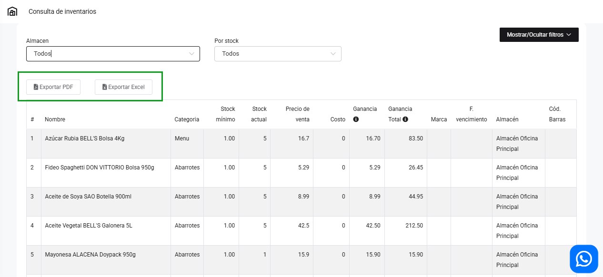

# Reporte inventario
En esta área te ayudaremos a revisar su inventario de manera global . Sigue estos pasos para realizarlo:

Ingresa al módulo de **Inventario**, luego selecciona la subcategoría **Reporte inventario.** 

## Consulta de Inventarios

**1.  Almacén:** Selecciona el almacén que desea ver su inventario. Hay una opción para ver todos los almacenes.

**2.  Por stock:** Selecciona el filtro en el cual desea ver su inventario:

* **Todos**
* **Stock < 0:** Stock menor a cero.
* **Stock = 0:** Stock igual a vero.
* **0 {'<'} Stock {'<='} Stock mínimo:** Mayor a cero y menor al stock mínimo.
* **Stock {'>'} Stock mínim    o:** Stock mayor al stock mínimo.
  
## Resultados
Una vez ingresado los datos, aparecerá una tabla con los siguientes datos:

* **Nombre:** Nombre del producto.
* **Categoría:** Categoría del producto.
* **Stock mínimo** 
* **Stock actual**
* **Precio de venta**
* **Costo:** Precio de compra.
* **Ganancia:** Es el resultado del precio de venta menos el costo del producto.
* **Ganancia total:** Es el resultado del precio de venta menos costo por la cantidad actual.
**Marca**
**F. vencimiento**
**Almacén**

## Exportar
Para exportar selecciona el botón **Exportar PDF** si desea el documento en **PDF**, y **Exportar Excel** si desea el documento en excel.

Una vez seleccionado el botón, tendrá que dirigirse al módulo **Reportes** en la sección **General** y la subcategoría **Bandeja descarga de reportes.**

Podrá observar el estado de la descarga, y finalmente descargar el archivo correspondiente.