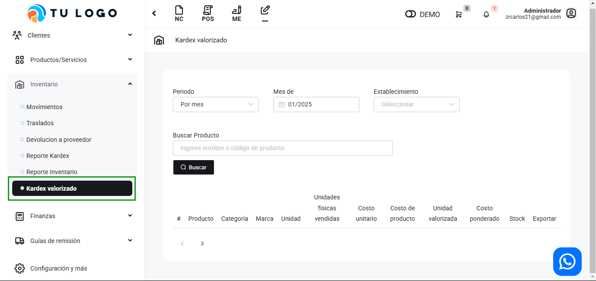
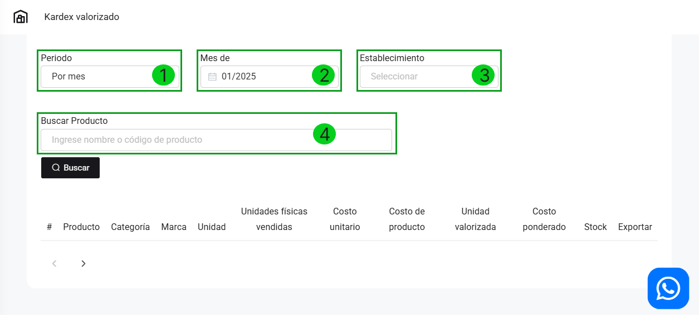

# Reporte Kardex valorizado

En esta área te guiaremos para utilizar el reporte Kardex Valorizado . Sigue estos pasos para realizarlo:

Ingresa al módulo de **Inventario**, luego selecciona la subcategoría **Kardex valorizado.**

## Botón buscar

Para el resumen de los productos, tenemos que llenar los siguientes filtros.

1. **Periodo:** Selecciona uno de los filtros de tu preferencia.

* **Por mes**: Útil para ver el movimiento de productos en un mes específico.
* **Entre meses**: Para comparar el inventario y ventas entre dos meses diferentes.
* **Por fecha**: Si deseas ver un solo día de operaciones.
* **Entre fechas**: Para observar el rendimiento de los productos en un rango de fechas específicas.

2. **Fecha:** Ingresa la fecha.

3. **Establecimiento:** Selecciona el establecimiento de donde desea ver los productos.

4. **Buscar Producto:** Selecciona el producto de su preferencia.

Después selecciona el botón **Buscar.**

Aparecerá la lista de todos los productos detalladamente.

Visualizaremos lo siguiente en la lista:

* **Producto:** El nombre del producto.
* **Categoría:** La categoría del producto.
* **Marca:** La marca del producto.
* **Unidad**
* **Unidades físicas vendidas:** La cantidad de productos vendidas.
* **Costo unitario:** El precio unitario del producto.
* **Valor de ventas:** El total de la ganancia bruta.
* **Costo de productos:** El costo total del producto vendido.
* **Unidad valorizada:** El total de la ganancia neta.
* **Costo ponderado:** Es el costo promedio por unidad, calculado dividiendo el costo total de los productos vendidos entre la cantidad de unidades físicas vendidas.
* **Stock:** Al seleccionar el botón se puede observar cuanto de stock queda.
* **Exportar:** Al seleccionar el botón, descarga un reporte detallado del producto.
