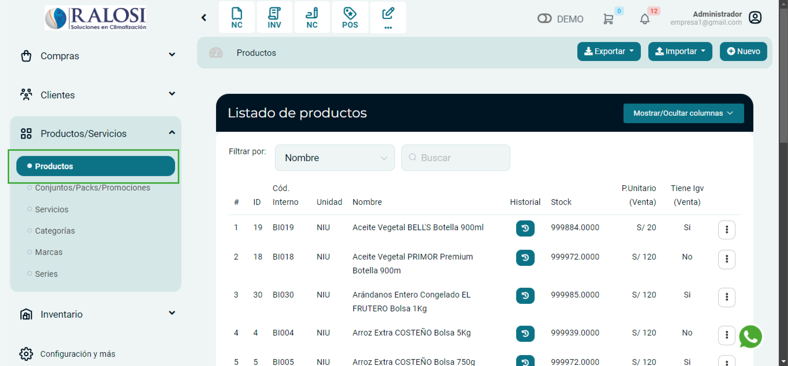
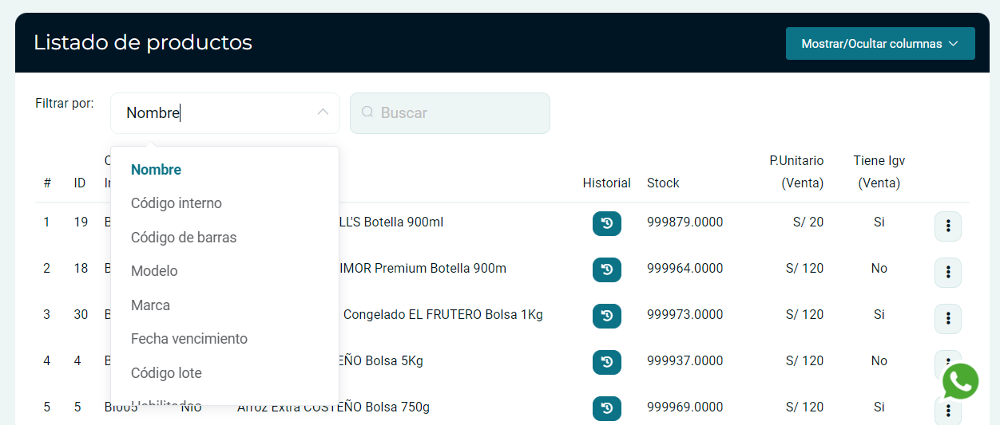
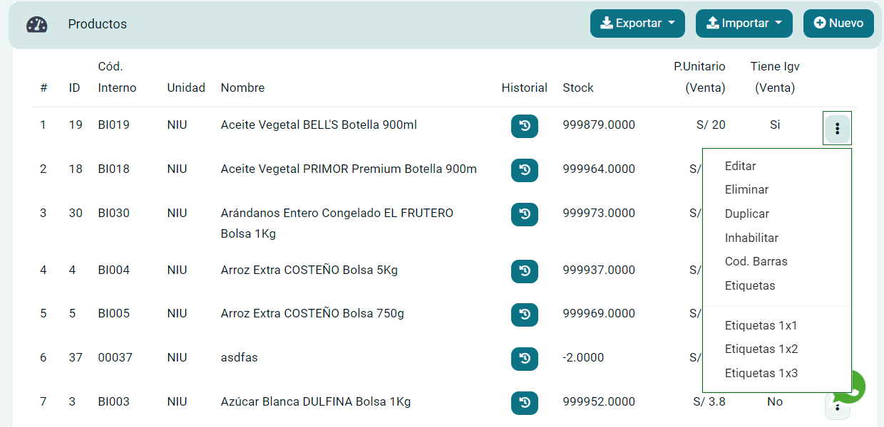

# Lista de productos

En esta área podrás conocer cómo gestionar la lista de productos y otras funciones importantes.

Sigue estos pasos para realizarlo:

Ingresa al módulo de **Productos/Servicios** y luego selecciona subcategoría **Productos**

## Listado de Productos

Se visualizarán diferentes funcionalidades de las secciones enumeradas.

**1.  Filtrar por:** En esta sección encontrará la información de producto de una forma más rápida y puede filtrar la búsqueda con diferentes opciones.

**2.  Historial:** Permite ver los detalles del Stock **/Últimas ventas/Últimas compras.**

**3.  Stock:** Permite visualizar el **inventario disponible** de los productos.

**4.  P.Unitario:** Valor del producto por unidad.

**5.  IGV(Venta):** Permite visualizar si el producto tiene IGV o no.

**6.  Botón 3 puntos:** Al seleccionar el botón desplegable, encontraremos otras opciones:

* **Editar:** Permite editar el producto.
* **Eliminar:** Permite eliminar el producto, si el producto ya ha sido utilizado en otra gestión, no se podrá eliminar.
* **Duplicar:** Permite duplicar el producto.
* **Inhabilitar:** No se elimina solo, se desactiva la existencia del producto.
* **Cód Barras:** Es el conjunto de líneas paralelas de distinto grosor y espaciado que identifican un producto.
* **Etiquetas:** Permite imprimir los códigos de barra en etiquetas para sus productos en tamaño 1x1 / 1x2 / 1x3.
  
**7.  Exportar:** Al seleccionar el botón desplegable, encontraremos otras opciones:

.jpg>)

* Listado: Permite descargar la lista completa de productos en excel. Se debe seleccionar el periodo y la fecha que desee exportar.

* Woocomerce: Permite descargar la lista completa de productos y porteriormente importarlo a Woocomerce.

* Etiquetas: Permite imprimir etiquetas de forma masiva de los productos.

* Atributos Extras:  Permite añadir características adicionales a los productos que no están cubiertas por los campos estándar.

* Bartender: Herramienta avanzada que permite generar e imprimir etiquetas personalizadas para productos. A través de la Generación de TXT para Bartender, se puede exportar información clave como Código Interno, Nombre, Código de Barras, Categoría, Unidad, Marca y Precio en formato de texto (CSV).

:::info RECOMENDACIÓN:
Para conocer cómo exportar de forma masiva, te invitamos a leer nuestro **[artículo](https://manual.uio.la/Pro7/modulos/Esenciales/productos-servicios/Productos-Exportar-masivamente)**.
:::

**8.  Importar:**

Al seleccionar el botón desplegable, encontraremos otras opciones:

.jpg>)

* **Productos:** Permite importar la lista completa de los productos.

* **L.Precios:**  Permite importar la lista de precios de los productos.

* **L.Atributos:**  Permite importar la lista de atributos de los productos.

* **Actualizar Precios:** Permite actualizar la lista de precios(P.Unitario/P.Unitario Compra).

:::info RECOMENDACIÓN:
Para conocer cómo importar de forma masiva, te invitamos a leer nuestro **[artículo.](https://fastura.github.io/documentacion/productos-servicios/Productos-Importar-masivamente)**
:::

**9.  Nuevo:** Permite crear un producto nuevo, creelo paso a paso en este **[artículo.](https://manual.uio.la/Pro7/modulos/Esenciales/productos-servicios/Productos-Creacion-basica)**
