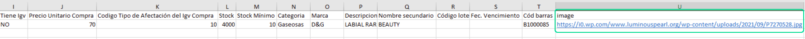
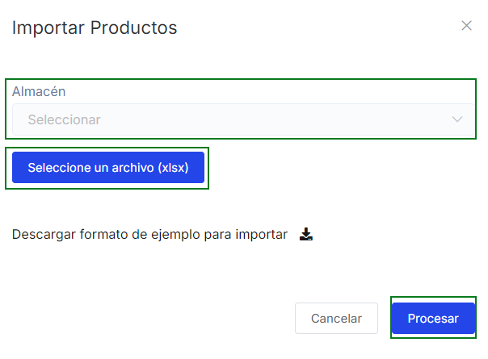

# Importar productos con imagen masivamente

En este artículo te enseñaremos a agregar imagenes a tus productos y puedas importarlas masivamente. Sigue estos pasos para realizarlo:

Ingresa al módulo **Productos/Servicios** en la subcategoría **Productos**, selecciona el botón **Importar** seguido selecciona **Productos.**

Seguido aparecerá la siguiente ventana emergente:

Selecciona **Descargar** formato de ejemplo para importar, seguido se descargará un archivo excel para completar los datos del producto, lo puede ver más detallado en el siguiente **[artículo.](https://fastura.github.io/documentacion/productos-servicios/Productos-Listas-de-Precio-Importar-Masivamente)**

Para agregar una imagen a cada producto, deberá realizar lo siguiente:

Implementar un campo, llamado image como se observa en la imagen. Y agregar el link de la imagen del producto.

:::danger IMPORTANTE:
* La imagen debe encontrarse en Internet.
* El link de la imagen debe acabar en el formato jpg o png, no acepta otro tipo de formatos.
:::

Seguido seleccione el **Establecimiento**, suba el archivo excel, y selecciona el botón **Procesar.**
