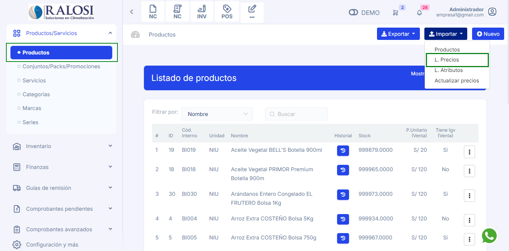
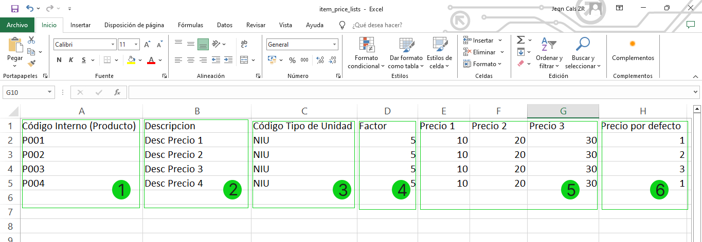
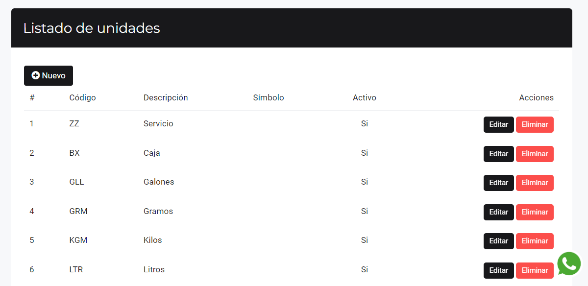

# Importar Listas de Precio

En esta área te ayudaremos a crear Listas de precios de manera masiva. Sigue estos pasos para realizarlo:

Ingresa al módulo de **Productos/Servicios** y luego selecciona subcategoría **Productos.** En la parte superior derecha selecciona el botón **Importar** después selecciona **L.Precios.**

Posteriormente aparecerá una ventana de **Importar** productos. Selecciona Descargar formato para importar.

Descargará un archivo en formato excel.

En este archivo tendrá que completar los siguientes campos necesarios:

**1.  Código interno (Producto):** Ingresa el código interno del producto.

**2.  Descripción:** Ingresa una breve descripción.

**3.  Código Tipo de Unidad:** Ingresa el código según corresponda el producto o el servicio.
- Para ver los códigos, dirígete a **Configuraciones y más** > **Configuraciones Globales**, luego ubica el submódulo de **Sunat** y selecciona la subcategoría **Listado de Unidades**.

:::danger IMPORTANTE:
Si no cuenta con un código interno en su empresa puede agregar por ejemplo 001, 002, etc.
:::

**4.  Factor:** La cantidad del producto a descontar del inventario.

**5.  Precio 1, Precio 2 o  Precio 3:** Ingresa el precio en escalera según corresponda como la imagen referencial. complete los dos otros campos con 0. De contar con mas precios, repita el proceso.

**6.  Precio por defecto:** Verificar en qué casilla están colocados los precios y insertar el número de casilla en Precio por Defecto. Un ejemplo en la siguiente imagen.

:::danger IMPORTANTE:
Ningún campo puede quedar vacío.
:::

Una vez rellenado el archivo excel, deberá seleccionar el botón **Selecciona un archivo (xlsx)**, para subir el archivo pdf correspondiente.

Finalmente selecciona el botón **Procesar**, se observará el **[Listado de productos]**.
