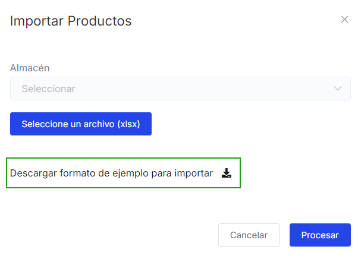
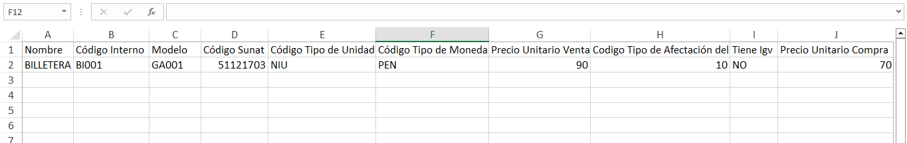

# Importar masivamente

En esta área te ayudaremos a crear productos de manera masiva. Sigue estos pasos para realizarlo:

Ingresa al módulo de **Productos/Servicios** y luego selecciona subcategoría **Productos.**
En la parte superior derecha selecciona el botón **Importar** después selecciona **Productos.**

Posteriormente aparecerá una ventana de **Importar** productos. Selecciona **Descargar** formato de ejemplo para importar.

Descargará un archivo en formato excel.

En este archivo tendrá que completar los siguientes campos necesarios:

**1.  Nombre:** Ingresa el nombre del producto.

**2.  Código Interno:** Ingresa el código interno del producto.

:::danger IMPORTANTE:
Si no cuenta con un código interno en su empresa puede configurar automáticamente desde el módulo **Configuración** en la sección **Avanzado** y la subcategoría **Inventarios.**
:::
**3.  Código tipo de Unidad:** Ingresa el código según corresponda el producto o el servicio.

- Para ver los códigos, dirígete a **Configuraciones y más** > **Configuraciones Globales**, luego ubica el submódulo de **Sunat** y selecciona la subcategoría **Listado de Unidades**.

:::danger IMPORTANTE:
Este listado lo pueden ubicar en el módulo **Configuración** en la sección Sunat en la subcategoría **Listado de unidades.**
:::
**4.  Código Tipo Moneda:** Ingresa **PEN** para soles o **USD** para dólares.

**5.  Precio Unitario venta:** Ingresa el precio del producto.

**6.  Código Tipo de afectación del IGV venta:** Colocar 10 para la opción **Gravado Operación Onerosa** en caso utiliza otro tipo de afectación consulte en nuestra lista de catálogos

**7.  Tiene IGV:** Ingresa SI para aplicar **IGV** en su producto; caso contrario ingresa **NO.**

**8.  Precio unitario de compra:** Ingresa el precio unitario de compra, en caso no lo conozca coloque 0.

**9.  Código Tipo de afectación IGV compra:** Colocar 10 para la opción Gravado Operación Onerosa en caso utiliza otro tipo de afectación consulte en nuestra lista de catálogos

**10.   Stock:** Ingresa la cantidad de unidades del producto. En en caso no lo considere coloque 0.

**11.   Stock Mínimo:** Ingresa la cantidad mínima de stock; la cantidad mínima de existencias de un producto que se puede permitir tener en su almacén.En en caso no lo consideren coloque 0.

:::danger IMPORTANTE:
- Solo los campos mencionados son obligatorios.

- Si en el archivo desea ingresar sus **[categorías](https://manual.uio.la/Pro7/modulos/Esenciales/productos-servicios/Gestionar-mis-categorias)** y **[marcas](https://manual.uio.la/Pro7/modulos/Esenciales/productos-servicios/Gestionar-mis-marcas)** debe tener en cuenta que en el sistema tiene que estar previamente agregadas.
:::

Una vez rellenado el archivo excel, deberá seleccionar en que **almacén** desea importar los productos, después selecciona el botón **Selecciona un archivo (xlsx)**,para subir el archivo pdf correspondiente.

Finalmente selecciona el botón Procesar, se observará el **[Listado de productos](https://manual.uio.la/Pro7/modulos/Esenciales/productos-servicios/Lista-de-productos)**, donde podrá visualizar su producto agregado.

:::danger IMPORTANTE:
Si va realizar la importación dos o más veces, aumentará el stock de los productos que se encuentran en sistema.
:::
