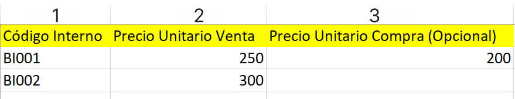

# Actualizar Precios de Productos

En esta área te ayudaremos a actualizar los precios de tus productos de manera masiva. Sigue estos pasos para realizarlo:

Ingresa al módulo de **Productos/Servicios** y luego selecciona subcategoría **Productos.** En la parte superior derecha selecciona el botón **Importar** después selecciona **Actualizar precios.**

Posteriormente aparecerá una ventana de **Actualizar** precio de los productos. Selecciona **Descargar formato de ejemplo para importar.**

Descargará un archivo en formato excel.

En este archivo tendrá que completar los siguientes campos necesarios:

**1.  Código Interno:** Ingresa el código interno del producto.

**2.  Precio Unitario Venta:** Ingresa el precio del producto.

**3.  Precio unitario de compra (Opcional):** Ingresa el precio unitario de compra, en caso no lo conozca coloque 0.

Una vez rellenado el archivo excel, deberá seleccionar el botón **Seleccione un archivo (xlsx)**,para subir el archivo correspondiente.

Finalmente selecciona el botón **Procesar**, se observará el **Listado de productos**, donde podrá visualizar sus productos con los precios actualizados.
