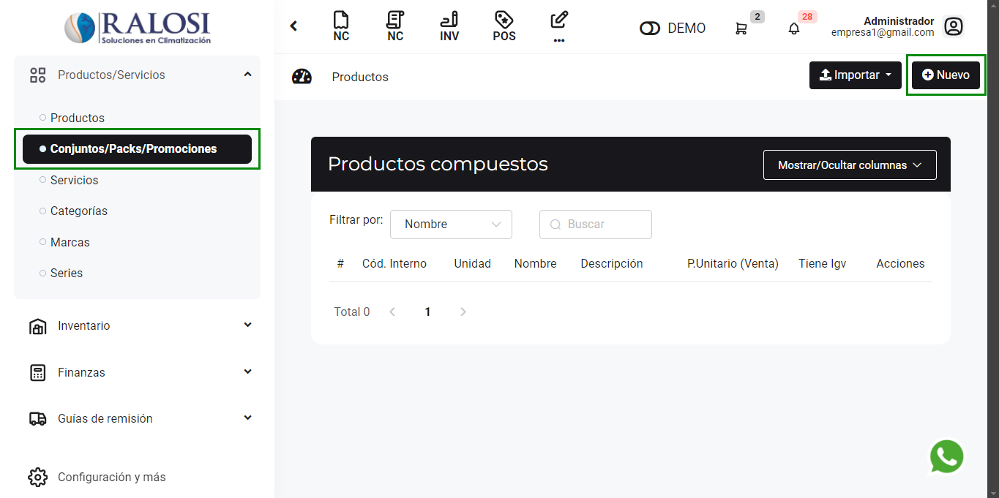

# Armar packs y promociones

En esta área te ayudaremos a crear **paquetes/promociones** para hacer más atractiva la forma de venta de tus productos o servicios.

Sigue estos pasos para realizarlo:

Ingresa al módulo **Productos/Servicios,** en la subcategoría **Conjuntos/Packs/Promociones.**

En la parte superior derecha selecciona el botón **Nuevo.**

Al seleccionar el botón **Nuevo,** se encontrará el formulario del nuevo producto compuesto.

## 1. Datos del producto compuesto  

Se procederá a ingresar los siguientes datos:  

- **1. Nombre:** Es el nombre del paquete promocional. `[1]`  
- **2. Descripción:** Agrega una breve descripción sobre el paquete. `[2]`  
- **3. Moneda:** Selecciona el tipo de moneda en dólares americanos o Soles. `[3]`  
- **4. Precio Unitario:** Es el valor monetario de su producto. `[4]`  
- **5. Unidad:** Son las unidades de medida; selecciona la que se acomode a su negocio. `[5]`  

### 2. Agregar Producto  

Posteriormente, selecciona el botón **Agregar producto** y se mostrará el siguiente formulario. `[6]`  

  

Se procederá a ingresar los siguientes datos:  

- **Producto:** Selecciona todos los productos creados previamente que conformarán el paquete promocional. Si los productos no están creados, podrá realizarlo paso a paso.  
- **Cantidad:** Ingresa la cantidad de los productos.  

### 3. Campos adicionales  

Se procederá a ingresar los siguientes datos:  

- **7. Imagen:** Selecciona la imagen de su paquete promocional. `[7]`  
- **8. Tipo de afectación (Venta):** Dejarlo por defecto en **Gravado - Operación Onerosa**. Si desea seleccionar otra opción, consulte con su contador. `[8]`  
- **9. Código Interno:** Es indispensable para una mejor organización y control de sus productos. `[9]`  
- **10. Categoría:** Selecciona la categoría que pertenezca a su paquete promocional. `[10]`  
- **11. Marca:** Selecciona la marca que pertenezca a su paquete promocional. `[11]`

Después selecciona el botón **Guardar**, donde visualizará la lista de los productos compuestos.

