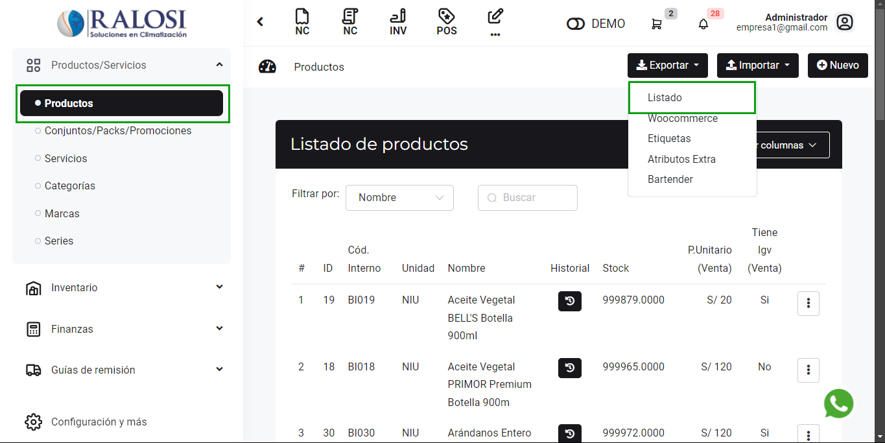
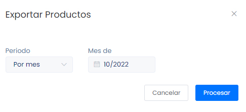
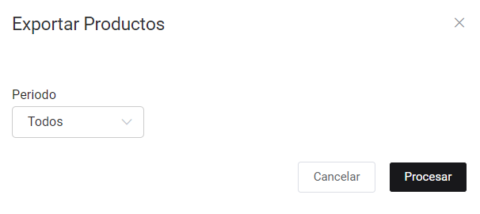
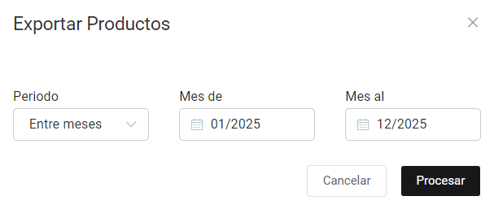

# Exportar masivamente

En esta área te ayudaremos a exportar productos de manera masiva. Sigue estos pasos para realizarlo:

Ingresa al módulo de **Productos/Servicios** y luego selecciona subcategoría **Productos.** En la parte superior derecha selecciona el botón **Exportar** después seleccione **Listado.**

Posteriormente aparecerá una ventana de **Exportar productos.** Deberá seleccionar el periodo que desea exportar productos.

## Todos

Al seleccionar el periodo **Todos,** se exporta todos los productos.

## Por mes

Al seleccionar el periodo **Por mes,** debemos seleccionar el mes y se exportara todos los productos ingresados del mes elegido.

## Entre meses

Al seleccionar el periodo **Entre meses,** debemos seleccionar el mes de inicio y mes de fin que queremos exportar; se exportara todos los productos ingresados de los meses elegidos.

Finalmente seleccione el botón **Procesar,** se descargará un archivo de formato excel, donde podrá observar los productos solicitados.
