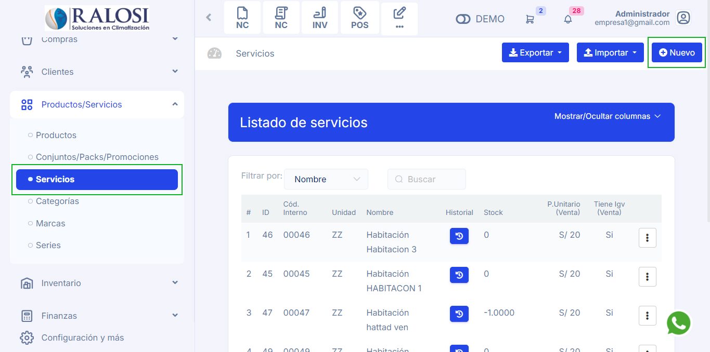
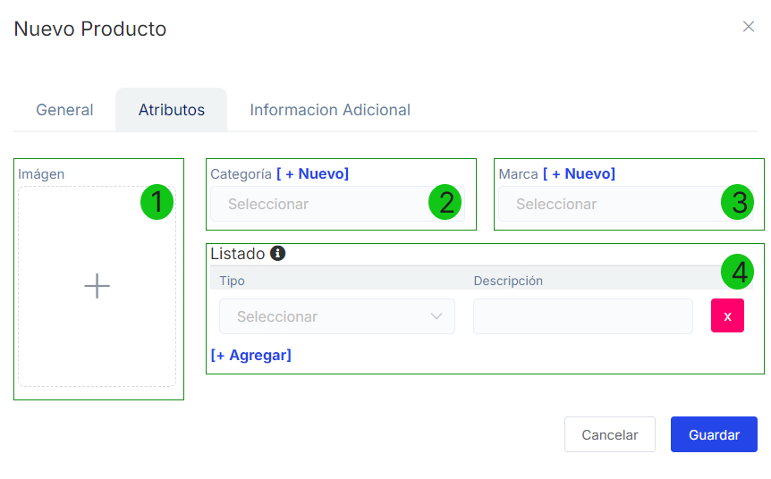

# Servicios: Creación
En esta área conocerá cómo crear un servicio. Sigue estos pasos:

Ingresa al módulo de **Productos/Servicios** y luego selecciona la subcategoría **Servicios.**

## Crear servicios
Selecciona el botón **Nuevo** que está en la parte superior derecha de la página.

Se encontrará el formulario de servicio y se completarán los siguientes datos.

## General

  **1.  Incluye Igv:** Seleccione la casilla de selección para aplicar **IGV** en su servicio.

  **2.  Nombre:** Ingrese el nombre del servicio.

  **3.  Descripción:**  Ingrese la descripción del servicio.

  **4.  Unidad:** Selecciona las unidades que se amolden a su servicio.

  **5.  Moneda:** Selecciona el tipo de moneda en soles o dólares.

  **6.  Precio unitario:** Ingresa el precio del servicio.

  **7.  Tipo de afectación:** Por defecto se selecciona **Gravado- Operación Onerosa** en caso de que utilice un tipo de afectación de **IGV** distinto, puede seleccionarlo.

:::danger IMPORTANTE:
Consulte con su contador si tiene dudas sobre que tipo de afectación deberá utilizar.
:::

**8.  Código Sunat:** Ingresa el código sunat, este código se lo proporciona la **SUNAT** si esta obligado.

**9.  Linea de producto:** Ingresa la línea de servicio, son los grupos de servicios que tienen relación directa entre sí. 

**10. Incluye percepción:** Selecciona la casilla de selección si el servicio incluye percepción; algunos servicios cuentan con percepción adicional al **IGV**. Añada el porcentaje de percepción de acuerdo a su régimen en caso lo requiera.

**11. Incluye ISC:** Selecciona la casilla de selección para aplicar **ISC**; elija el Tipo de sistema **ISC** que requiera; ingrese el porcentaje.

**12. Sujeto a detracción:** Selecciona la casilla si el servicio que está sujeto a detracción.

## Atributos

**1.  Imagen:** Inserta la imagen del servicio.

**2.  Categoría:** Selecciona la categoría del servicio, caso contrario deberá crearlo seleccionando el botón **[+Nuevo].** Deberá escribir el nombre de la categoría que desee crear y después seleccionar el botón  **[+Guardar].**

**3.  Marca:** Selecciona la marca del servicio, caso contrario deberá crearlo seleccionando el botón **[+Nuevo]**.Deberá escribir el nombre de la marca que desee crear y después seleccionar el botón  **[+Guardar].**

**4.  Listado:** Selecciona el botón **[+Agregar]** para agregar una lista de atributos, seleccione el tipo y añada una descripción si lo cree necesario.

Finalmente, selecciona el botón **Guardar**, y se observará el **Listado de servicios**, donde podrá visualizar los servicios creados.
