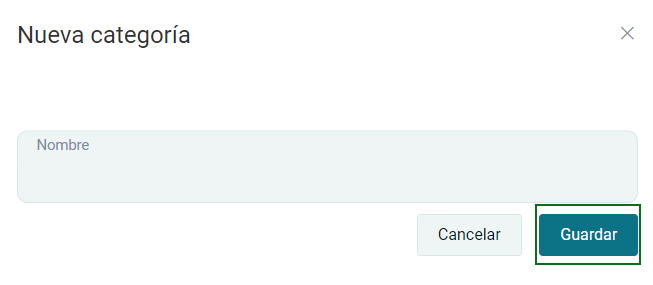

# Categorías

En esta área conocerá cómo crear una nueva categoría y gestionar la lista de categorías.

Ingresa al módulo de **Productos/Servicios** y luego selecciona la subcategoría **Categorías.**

## Listado de categorías

Selecciona el botón **Nuevo** que está en la parte superior derecha de la página.

Visualizará el formulario de nueva categoría, después deberá ingresar el nombre de la  categoría y luego selecciona el botón **Guardar.**

Posteriormente encontrará el listado de categorías que se han creado y tiene las opciones de eliminar y editar.

