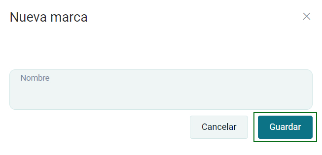
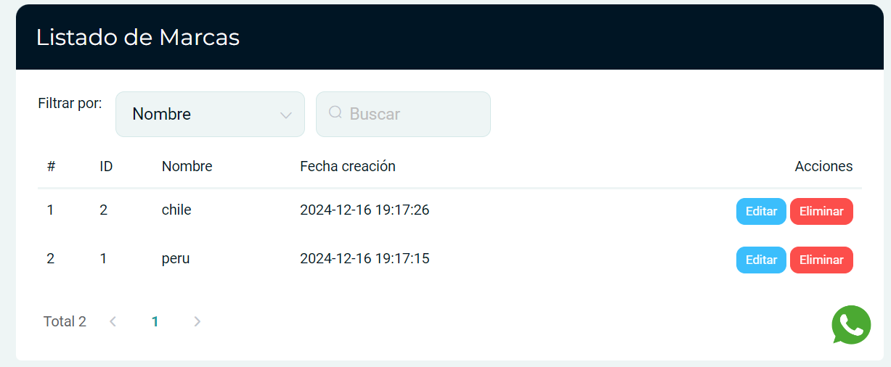

# Marcas

En esta área conocerá cómo crear una nueva marca y gestionar la lista de marcas.

Ingresa al módulo de **Productos/Servicios** y luego selecciona la subcategoría **Marcas.**

## Listado de marcas

Selecciona el botón Nuevo que está en la parte superior derecha de la página.

Visualizará el formulario de nueva marca, después deberá ingresar el nombre de la  marca y luego selecciona el botón **Guardar.**

Posteriormente encontrará el **listado de categorías** que se han creado y tiene las opciones de **eliminar y editar.**

