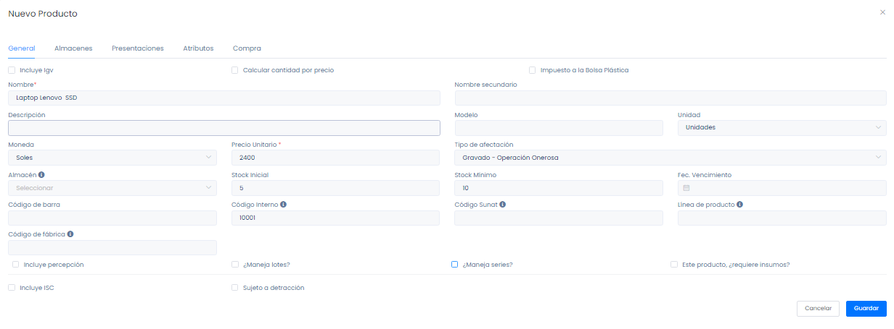

# Series

En esta área conocerá cómo crear las series para la identificación de sus productos. Sigue estos pasos para realizarlo:

## Creación de series

Para crear la serie, primero deberás ingresar al módulo de **Productos/Servicios** y luego selecciona la subcategoría **Productos.**

En la parte superior derecha selecciona el botón **Nuevo.**

Posteriormente visualizará el formulario del **Nuevo producto.**

Se procederán a llenar los siguientes campos:

* **Nombre:** Ingrese el nombre del producto
* **Unidad:** Selecciona las unidades que se amolden a su servicio
* **Moneda:** Selecciona el tipo de moneda en Soles/Dólares
* **Precio unitario:** Ingrese el precio del producto
* **Stock inicial:** Ingrese la cantidad de unidades del producto y después deberá activar la casilla de **¿Maneja series?**

## Activar casilla serie

Posteriormente visualizará las filas generadas que tienen relación con el stock inicial de su producto.

Asimismo deberá añadir la serie, el estado activo y la fecha de creación.

También cuenta con la opción de eliminar el campo de serie seleccionando el botón de papelera [🗑️]

Después seleccione el botón **Guardar.**

## Listado de series

Finalmente para visualizar el listado de las series creadas dirígete al módulo **Productos/Servicios** y luego selecciona la subcategoría **Series.**
