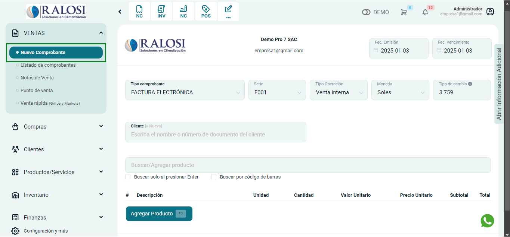
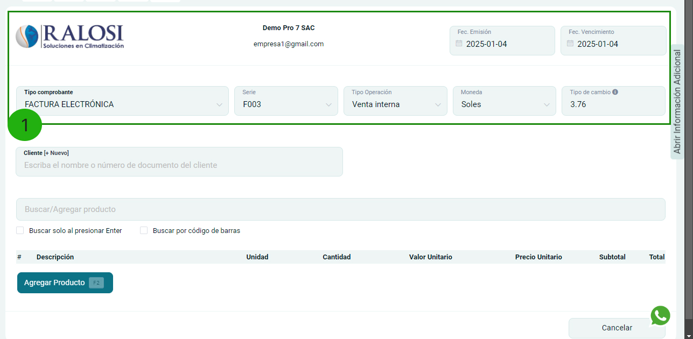
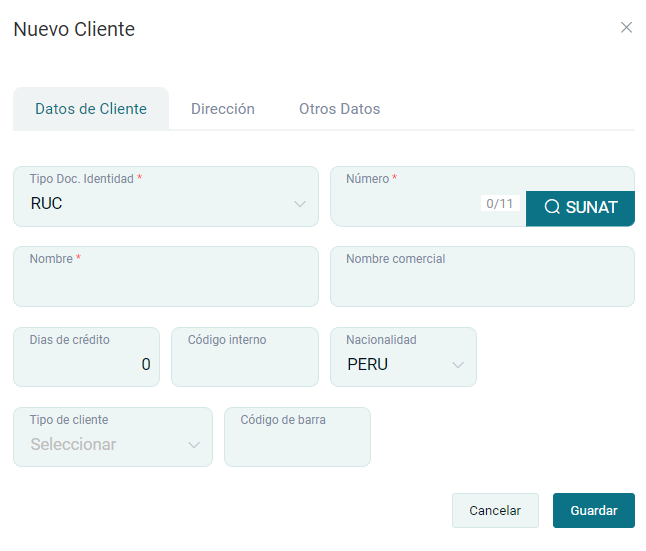
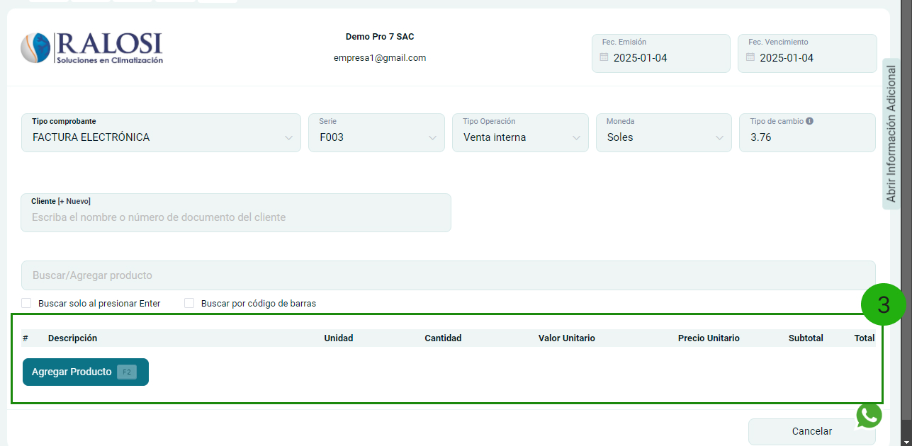
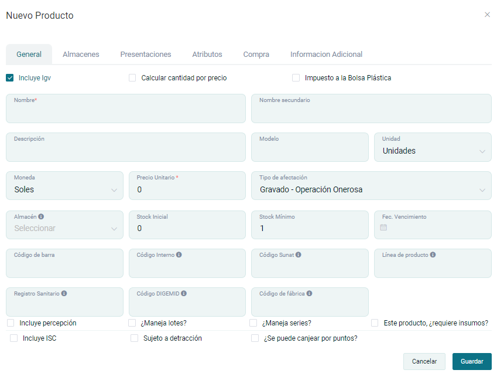
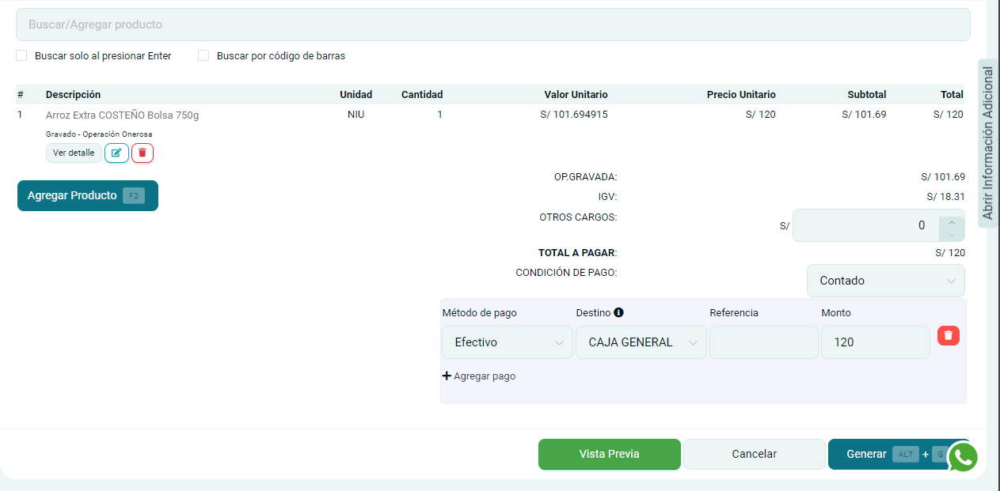
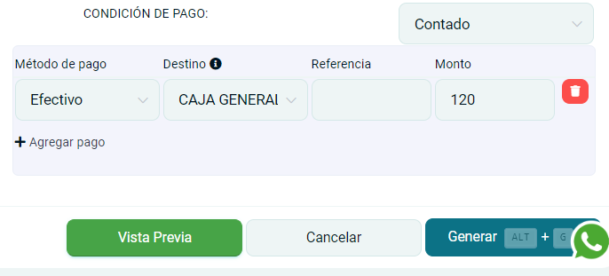
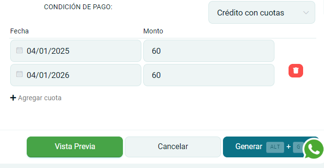

# Nuevo Comprobante

En esta área podrás generar comprobantes electrónicos y crear nuevos clientes.Sigue estos pasos para realizarlo:

Ingresa al **módulo de ventas** y luego selecciona subcategoría **comprobantes electrónicos**.

**1. Crear comprobante**

En esta sección podrá empezar con la creación de su comprobante electrónico y realizar otras importantes configuraciones.

Se encontrará el formulario del tipo de comprobante y se completarán los siguientes datos:

:::info IMPORTANTE

Se puede crear un comprobante con un día de retaso.

:::

- **Tipo de comprobante:** Selecciona factura o boleta electrónica
- **Serie:** Establecido por defecto según el tipo de comprobante
- **Tipo operación:** Seleccione la que más se adecue a la venta.
- **Moneda:** Seleccione moneda en dólares americanos o Soles
- **Tipo de cambio:** Es el tipo de cambio extraído por la SUNAT
- **Fecha de emisión:** Es el día que se emite el comprobante
- **Fecha de vencimiento:** Es el día que se tiene que pagar el comprobante.

:::danger IMPORTANTE:

Puede emitir boletas electrónicas por montos menores a 700 soles con el cliente **"Clientes Varios"**, cuando el monto sea mayor es obligatorio colocar la identidad del cliente sea DNI o RUC.

:::

**2. Crear nuevo cliente**
En esta sección escogerá el cliente para la creación del comprobante, caso contrario deberá crearlo seleccionando el botón **[+Nuevo]**.

Posteriormente aparecerá el formulario de **Nuevo cliente**.

Se procederá a ingresar los siguientes datos:

- **Tipo Doc.Identidad:** Seleccione RUC,DNI,CE,etc
- **Número:** Ingrese el número que corresponde al  tipo de documento Identidad
- **Nombre:** Se autocompletará el nombre que corresponde al  tipo de documento Identidad

La sección de **dirección y otros datos** deberá completarlos según el requerimiento de su empresa.

Después selecciona el botón **Guardar**.

:::danger

Todos los campos que cuentan con **(*)** son obligatorios.

:::

**3. Agregar Producto**
Selecciona el botón **Agregar producto.**

Posteriormente se encontrará el formulario de **Agregar Producto o Servicio**.

Se procederá a ingresar los siguientes datos:

- **Producto/Servicio:** Si el producto se creó previamente, se visualizará en la lista de opciones,si no lo está,podrá crearlo seleccionando el botón **[+Nuevo]**
- **Cantidad:** Ingresa la cantidad de productos
- **Precio unitario**
- **Nombre del producto en PDF:** Ingresa la descripción del producto
- **Agrega descuentos,cargos o Atributos especiales**

Después selecciona el botón **Guardar**, donde visualizará la descripción del comprobante.

**4. Crear nuevo producto**
Selecciona el botón Nuevo ,donde aparecerá el formulario para llenar los datos del nuevo producto:

Se procederá a ingresar los siguientes datos:

- **Nombre**
- **Descripción**
- **Tipo de moneda**
- **El precio unitario**
- **El stock inicial.**
- **Selecciona las unidades que se amolden a su servicio.**
- **Activar si el producto incluye IGV.**

Después selecciona el botón **GUARDAR**, y se visualizará esta ventana en la sección descripción

**5. Condiciones de pago**
Selecciona el tipo de condición de pago que mejor se acomode a tus requerimientos.

- **Contado:** Deberá escoger el método de pago, el destino donde ingresará el dinero automáticamente,la referencia y el monto en total. Además también es factible añadir otros métodos de pago.

- **Crédito:** El método de pago y la fecha a pagar, pueden ser configurados en CONFIGURACIÓN - Métodos de pago - Ingreso .

- **Crédito a cuotas:** Deberá escoger la fecha de pago y el monto,asimismo también es factible añadir la cantidad de cuotas que requiera.

:::info

Si escogió el método crédito o crédito a cuotas, podrá visualizar el pendiente de pago: Ingresando a módulo de finanzas y en la sección cuentas por cobrar.

:::

Después selecciona el botón **Generar**, donde se visualizará  una ventana indicando que la factura ha sido aceptada.

Además podrás escoger el formato del comprobante electrónico en tamaño **A4(vertical), 80MM (ticket) y A5(horizontal)**.

Asimismo puedes enviarlo por **correo electrónico o WhatsApp**, ingresando el dato del destinatario y seleccionando el botón **Enviar**.

Finalmente puedes seleccionar el botón  **ir al listado**, donde visualizará los comprobantes generados,  o proceder a **crear nuevo comprobante**.
