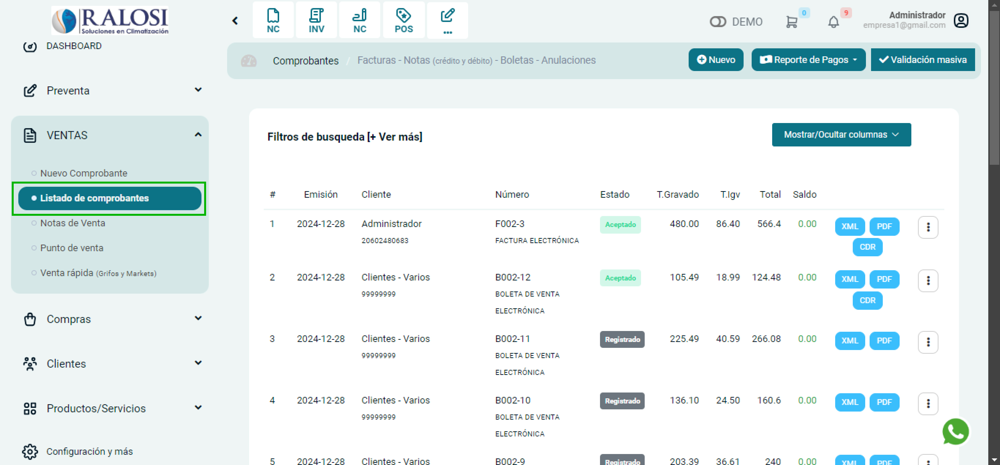
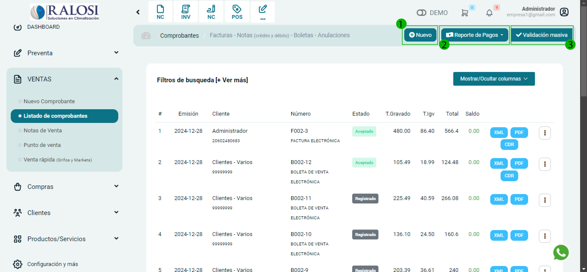
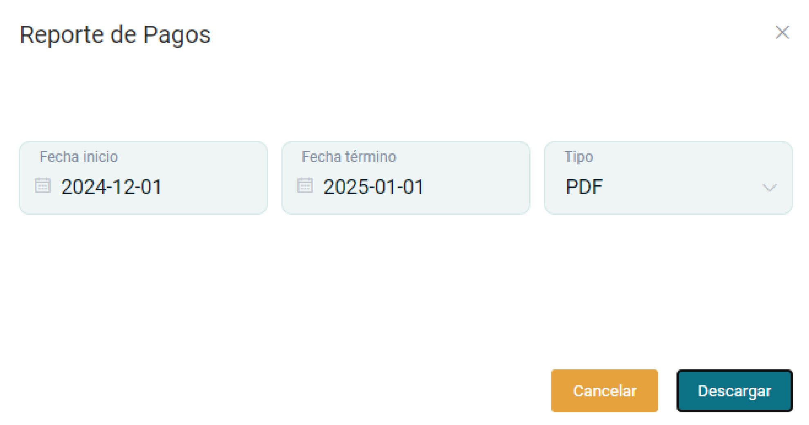
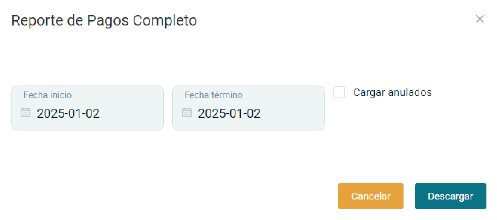
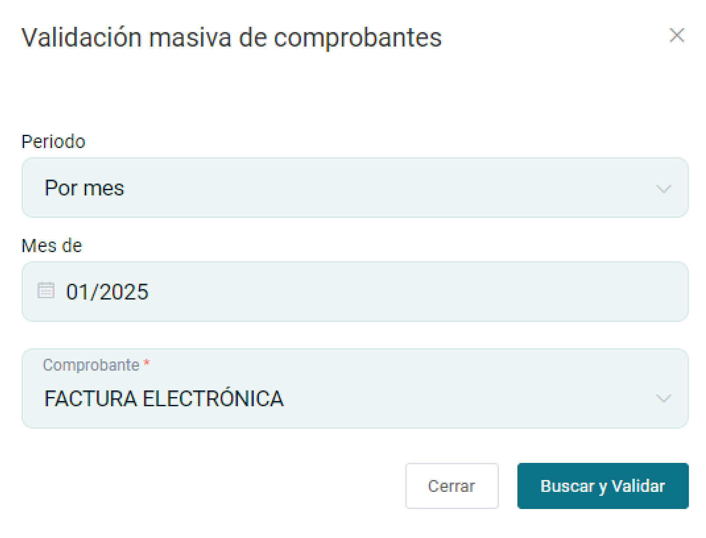
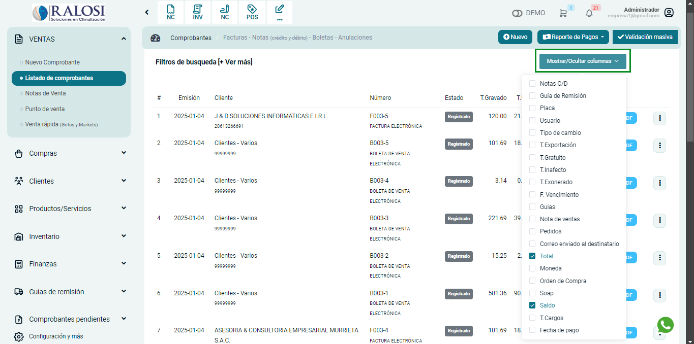
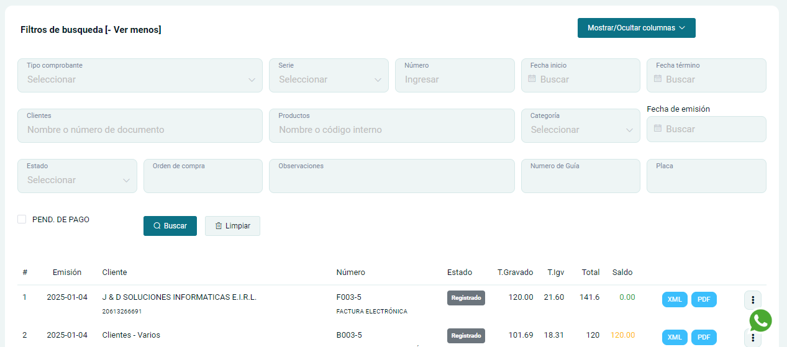
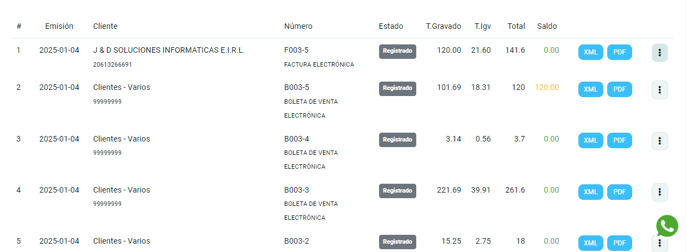
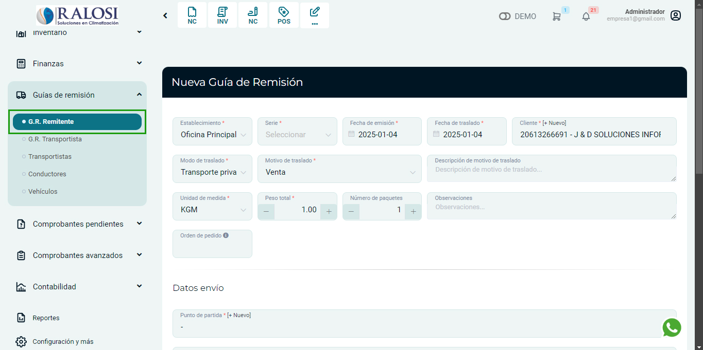
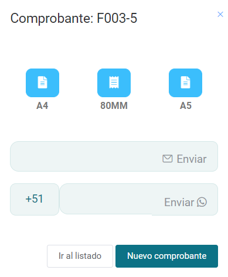

# Lista de Comprobantes 

En esta área podrás conocer las acciones que puede realizar en el módulo lista de comprobantes.

Ingresa al **módulo de ventas** y luego ir a **Listado de Comprobantes**.

## Botones de acción

En esta sección te explicaremos la función de cada botón enumerado.

**1. Nuevo:**
Al seleccionar el botón **Nuevo**, aparecerá el formulario para crear un nuevo comprobante de pago.Te invitamos a leer nuestro artículo **[Emitir comprobantes: Facturas y Boletas](https://fastura.github.io/documentacion/ventas/Emitir-comprobantes-Facturas-y-Boletas)**, donde te explicaremos paso a paso,como realizarlo.

**2. Reporte de Pago:**
Al seleccionar el botón desplegable, podrás generar el reporte de los pagos que se hayan realizado,y también descargarlos.

Observaremos las siguientes subcategorías:

- **Genera un reporte:** Seleccione el periodo de fechas de los reportes a descargar y el tipo de formato **PDF/ Excel**. Posteriormente selecciona el botón **descargar.**

- **Descargar Excel:** Seleccione el periodo de fechas de los reportes a descargar. Posteriormente selecciona el botón descargar.

**3. Validación masiva**
En esta sección se corroborará que los comprobantes electrónicos, tanto en la plataforma como en SUNAT,presenten el mismo estado.

Al seleccionar el botón **✓Validación masiva** nos aparecerá el formulario.

Se procederá a ingresar los siguientes datos:

- **Periodo**
- **Mes**
- **Tipo de comprobante**

Después selecciona el botón **Buscar y Validar**.

**4. Mostrar/Ocultar ventanas**
En esta área podrás modificar la tabla que te aparece por defecto; se pueden añadir por columnas.

**5. Filtros de búsqueda**
En esta área podremos buscar cualquier tipo de comprobantes de pago.

Al seleccionar el botón **[+Ver más]** donde nos aparecerá el formulario

Se puede filtrar la lista mostrada por los siguientes datos:

- **Tipo de comprobante**
- **Serie**
- **Número**
- **Fecha de Inicio**
- **Fecha término**
- **Clientes**
- **Productos**
- **Categoría**
- **Fecha de emisión**
- **Estado**
- **Orden de compra**
- **Número de Guia**
- **Placa**
- **Pend. de pago**

Después selecciona el botón **GUARDAR**, donde visualizará la lista de comprobantes que ha filtrado.

**6. Otras acciones**
**Comprobantes de SUNAT**

Puedes descargar los comprobantes en diferentes formatos:

- **XML,** un archivo encriptado emitido por SUNAT(✓)
- **PDF,** archivo pdf del documento seleccionado (✓)

**Botón lado derecho 3 puntos desplegables**

- **Guía:** En esta sección seras rediccionado al modulo **Guias de Remision** donde podrás emitir guías de remisión y quedarán enlazadas con el comprobante, asimismo se completaran automáticamente los campos Cliente y Productos.

- **Anular:** En esta sección podrás anular comprobantes electrónicos de manera directa, mira nuestro artículo aquí, donde te enseñaremos a realizarlo paso a paso.

- **Opciones:** En esta sección podrás reimprimir el comprobante de pago, enviarlo a correo electrónico o whatsapp. Además podrás escoger el formato del comprobante electrónico en tamaño **A4(vertical), 80MM (ticket) y A5(horizontal)**.

- **Pago:** En esta sección podrás gestionar los pagos pendientes,caso contrario la ventana a mostrar estará vacia.

