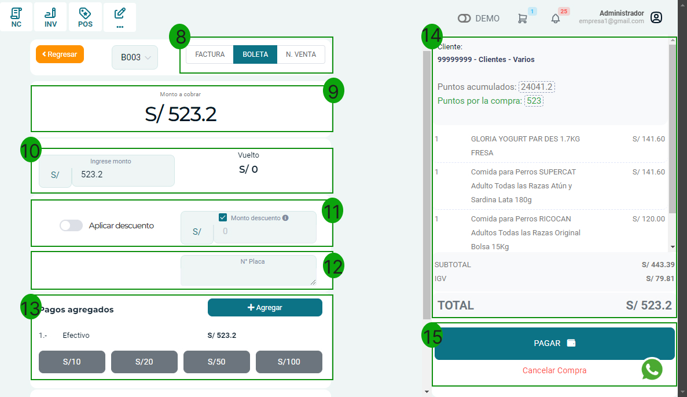
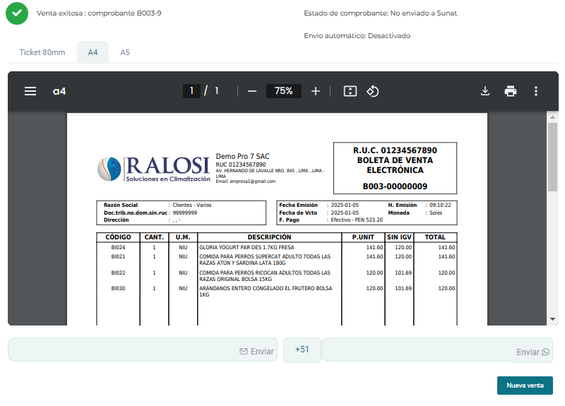

# Puntos de venta

En esta área te ayudaremos a como gestionar tu punto de venta de la manera más práctica y eficaz. Sigue estos pasos para realizarlo:

## Módulo 
Ingresa al módulo **Ventas** , en la subcategoría **Punto de venta**. Se visualizarán las categorías de los productos.

Principalmente, encontraremos varias secciones y botones:

1. Activa el botón deslizable para buscar con  el escáner de código de barras
2. Podrás seleccionar diferentes tipos de vista de los productos
3. Se visualizarán las categorías de los productos
4. Agrega el cliente creado previamente,caso contrario,podrás seleccionar el botón **[ + ]** para crear un nuevo cliente, asimismo puedes borrar el cliente con el icono de tacho **[ 🗑 ]**,o cambiar el tipo de moneda de soles a dólares con el boton **[ S/ ]**
5. En esta sección estarán agregados los productos que se venderán.
6. Se visualizarán los datos del precio del producto.
7. En esta sección se visualizará el monto total a cobrar, para continuar deberás seleccionar el botón **Pagos**
Nos redirigirá a otra ventana:

8. Selecciona el tipo de comprobante **(Factura  / Boleta / N. venta)**

9. Se visualizará el monto a cobrar.

10. Ingresa el monto y se mostrará el vuelto o diferencia

11. Podrás aplicar el descuento seleccionando el botón deslizable **aplicar descuento,** luego añade el monto o cantidad de descuento

12. Podrás aplicar el N° de Placa al producto

13. Podrás agregar el tipo de pago o añadir el monto en efectivo

14. En esta sección se visualizará el subtotal, igv y el total a pagar

15. Un vez se hayan realizado los pasos anteriores, podrá proceder a pagar o cancelar.

Posteriormente al seleccionar el botón **Pagar,** aparecerá una nueva venta indicando que la venta ha sido exitosa.

Asimismo puedes imprimir el comprobante en formato **ticket /A4 /A5,** finalmente puedes enviarlo por **correo electrónico o WhatsApp**, ingresando el dato del destinatario y seleccionando el botón **Enviar**.

