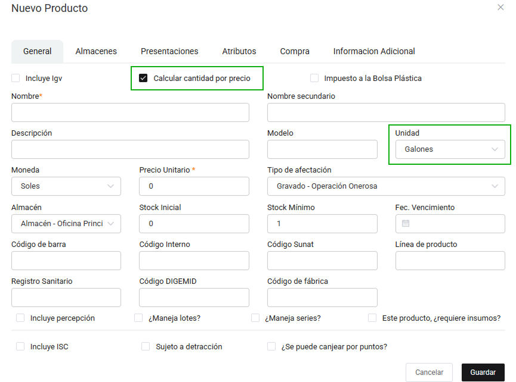

# Venta Rápida

La funcionalidad de **Venta Rápida** te permite agilizar las transacciones y está especialmente orientada para grifos y minimarkets.

## ¿Cómo acceder a la Venta Rápida?

1. Ingresa al menú lateral izquierdo y selecciona la opción **VENTAS**.
2. Haz clic en **Venta rápida (Grifos y Markets)**.
3. Se abrirá la pantalla principal de Venta Rápida donde podrás buscar y seleccionar productos de manera inmediata.

---

## Productos visibles en Venta Rápida

:::info Importante
La funcionalidad de **Venta Rápida** está especialmente orientada para grifos y minimarkets, donde la agilidad y simplicidad en la selección de productos es fundamental.
:::

En este apartado, **solo aparecerán automáticamente** los productos que cumplan con al menos una de estas condiciones:

- Tienen como tipo de unidad una unidad relacionada a combustibles **galones**
.
- Tienen activada la opción **Calcular cantidad por precio** en su configuración.

Esto permite que, al ingresar a la pantalla de Venta Rápida, puedas ver y seleccionar de forma inmediata los productos más usados en este tipo de negocios, facilitando la venta de productos que se comercializan por volumen o importe.

> **Nota:**  
> Los demás productos que no cumplan con estas condiciones **no se mostrarán por defecto** en la pantalla principal de Venta Rápida. Sin embargo, puedes encontrarlos y agregarlos fácilmente utilizando la barra de búsqueda.

---

**Ejemplo visual:**  
En la pantalla de creación de productos, asegúrate de marcar la casilla **Calcular cantidad por precio** o seleccionar la unidad adecuada (como **galones**) para que el producto esté disponible en la Venta Rápida.

En el módulo de **Venta Rápida**, estos productos aparecerán listados para su selección directa, optimizando el proceso de venta.

