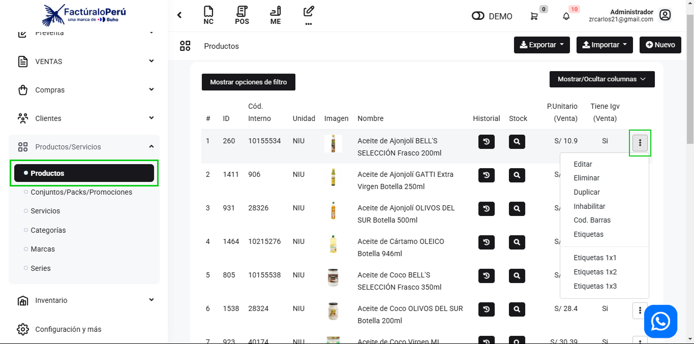

# Configurar productos para producción

En esta área te ayudaremos a configurar productos para producción. Sigue estos pasos para realizarlo:

Ingresa al módulo de **Productos** luego selecciona la subcategoría **Productos**.En la parte lateral derecha selecciona los **tres puntos.**

Nos aparecerá la siguiente ventana emergente:

Tendrá que seleccionar la casilla de selección **Este producto, ¿requiere insumos?**

Al seleccionarlo le aparecerá una nueva sección:

En donde podrá agregar los producto para la producción, seleccionando el botón **Agregar Producto**, seguido inserte la cantidad del producto y seleccione el botón **Guardar**.

