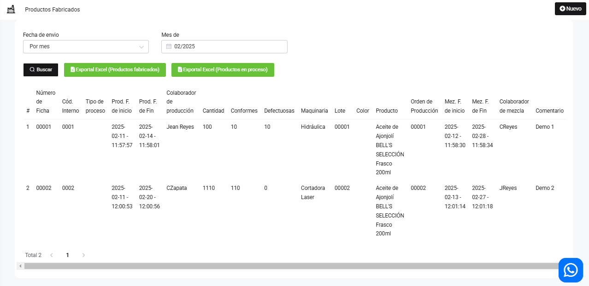

# Producto Fabricado

En este artículo te enseñaremos a agregar productos fabricados. Sigue estos pasos para realizarlo:

Ingresa al módulo **Producción**, y luego en la subcategoría **Productos fabricados**, selecciona el botón **Nuevo**.

Para crear una nuevo producto fabricado, completa los datos que requiere:

:::danger IMPORTANTE:
Si seleccionamos que es una ficha informativa, lo que va hacer el sistema es guardarlo como información, no agregara stock al producto ni descontara los insumos.
:::

Seguido selecciona el botón Guardar. Y podrá observar la lista de Productos Fabricados:

Podrá exportar un excel de los productos fabricados y productos en proceso.
