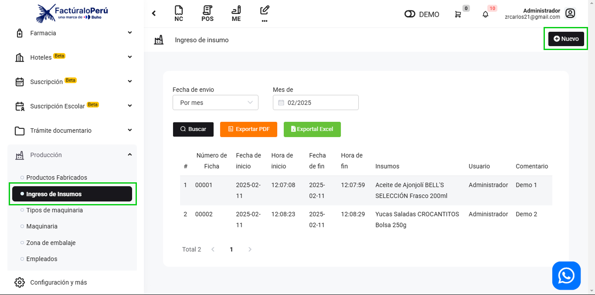
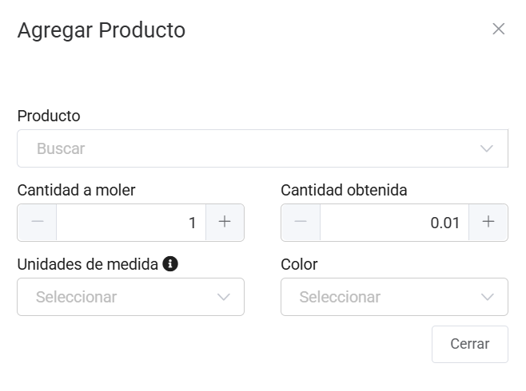
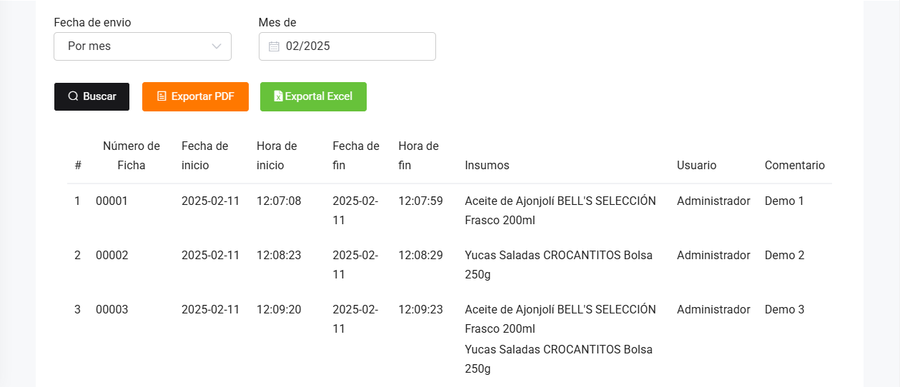

# Ingresos de Insumo

En este artículo te enseñaremos a registrar material que puede reutilizar. Sigue estos pasos para realizarlo:

Ingresa al módulo **Producción**, y luego en la subcategoría **Ingresos de insumo**. En la parte superior derecha selecciona el botón **Nuevo**.

Para crear un nuevo ingreso de insumo, completa:

- **Fecha de inicio:** Selecciona la fecha de inicio.
- **Hora de inicio:** Selecciona la hora de inicio.
- **Fecha de Finalización:** Selecciona la fecha de Finalización.
- **Hora de Finalización:** Selecciona la hora de Finalización
- **Número de ficha:** Inserta el número de ficha.
- **Comentario:** Inserta un pequeño comentario.
- **Molino:** Inserta el molino.
- **Lote:** Inserta el lote.
- **Seleccionar insumo:** Al seleccionar le aparecerá la siguiente ventana emergente.

Tendrá que completar los datos:

Una vez completado, selecciona el botón **Agregar**.

Seguido selecciona el botón **Generar**. Y podrá observar la lista de las máquinas creadas:

Podrá exportar un reporte en **PDF** y en **Excel**.
