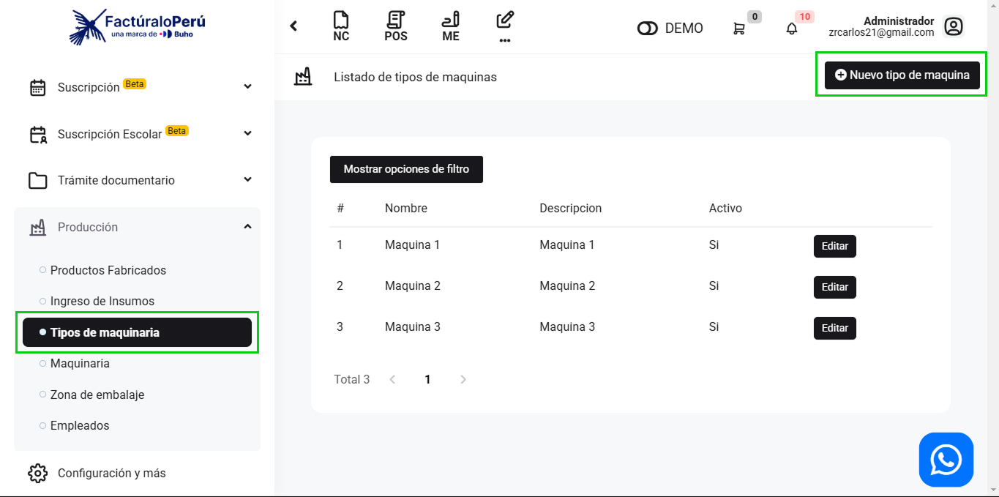

# Tipo de Maquinaria

En este artículo te enseñaremos a crear los tipos de maquinarias para tu producción; con este articulo podrá agregar la categoría de la máquina y para que sirve. Sigue estos pasos para realizarlo:

Ingresa al módulo **Producción**, y luego en la subcategoría **Tipos de maquinaria**, En la parte superior derecha selecciona el botón **Nuevo tipo de maquinaria**.

Para crear un nuevo tipo de máquina, completa:

- Nombre: Inserta el nombre de la máquina.
- Descripción: Inserta una breve descripción acerca de la máquina.
- Activo: Activa el interruptor si la máquina se encuentra activa.

Seguido selecciona el botón Guardar. Y podrá observar la lista de tipo de máquinas creadas:

