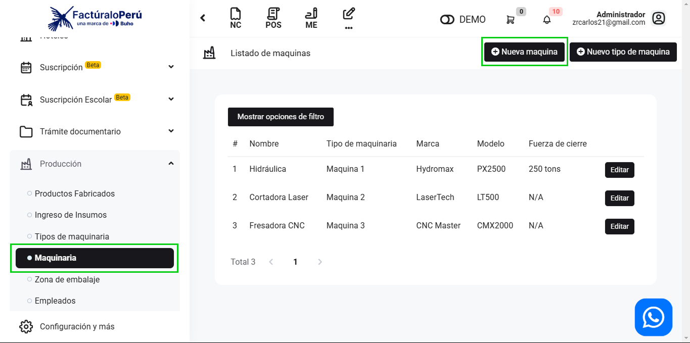

# Maquinaria

En este artículo te enseñaremos a crear maquinarias para tu producción; con este articulo podrá agregar la maquina en especifico, como la marca, modelo, fuerza de cierre. Sigue estos pasos para realizarlo:

Ingresa al módulo **Producción**, y luego en la subcategoría **Maquinaria**, en la parte superior lateral, hay dos botones: Nueva máquina, **[Nuevo tipo de maquina](https://fastura.github.io/documentacion/docs/Pro7/Modulos/Especificos/produccion/Tipo-de-maquinaria)**.

## Nueva máquina

Para crear una nueva maquina, selecciona el botón **Nueva máquina**.

Para crear una nueva máquina, completa:

- **Tipo de maquina:** Selecciona el tipo de maquina creada previamente, si aún no creaste una, aprende como **[aquí](https://manual.uio.la/Pro7/modulos/Especificos/produccion/Tipo-de-maquinaria)**.
- **Nombre:**  Inserta el nombre de la maquina.
- **Marca:** Inserta la marca de la maquina.
- **Modelo:** Inserta el modelo de la maquina.
- **Fuerza de cierre:** Inserta la fuerza de cierre

Seguido, selecciona el botón **Guardar**.  Y podrá observar la lista de las máquinas creadas:

