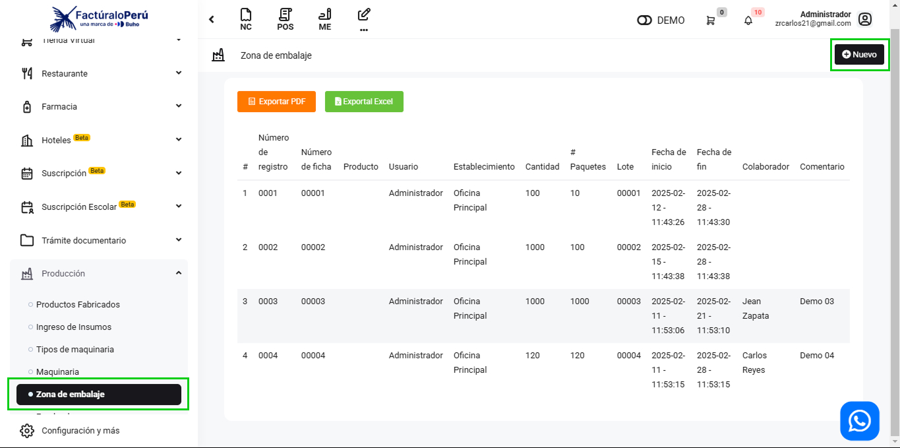
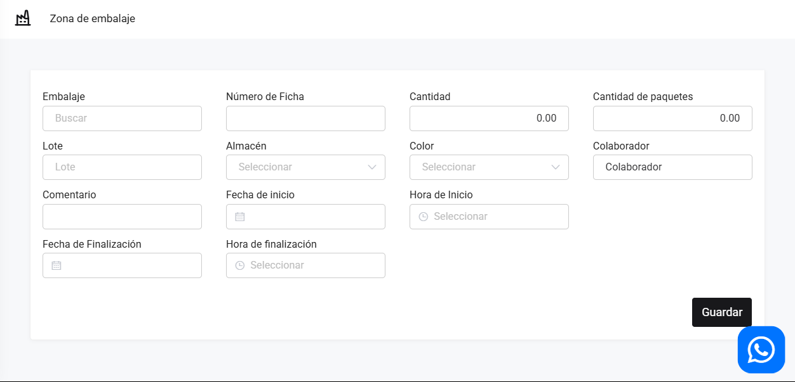
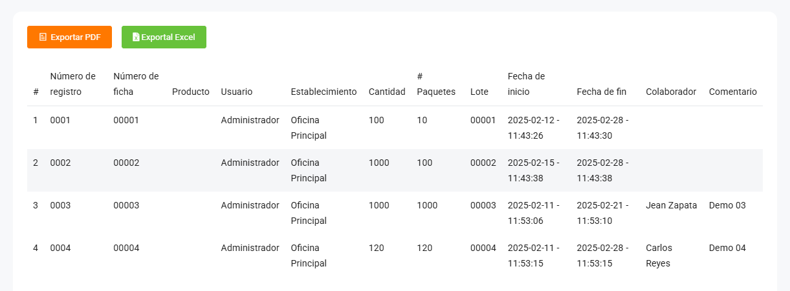

# Zona de Embalaje

En este artículo te enseñaremos a manejar la zona de embalaje, esta área es una zona de registro donde se añade los paquetes. Registra tipo de empaquetadura. Sigue estos pasos para realizarlo:

Ingresa al módulo **Producción**, y luego en la subcategoría **Zona de embalaje**, en la parte superior derecha selecciona el botón **Nuevo**.

Para crear una zona de embalaje, completa los datos que requiere:

 Seguido selecciona el botón **Guardar**. Y podrá observar la lista de Zona de embalaje:

Podrá exportar un reporte en **PDF** y en **Excel**.
