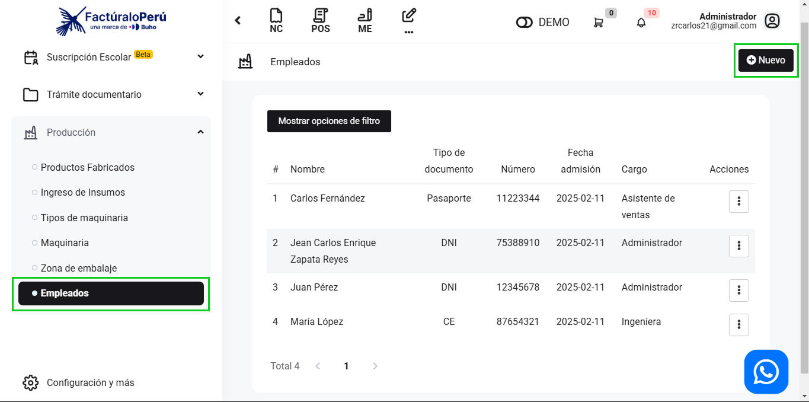
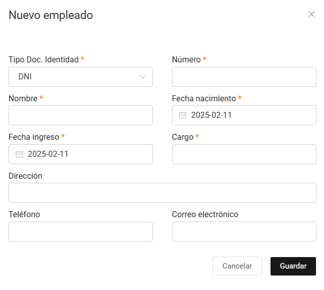
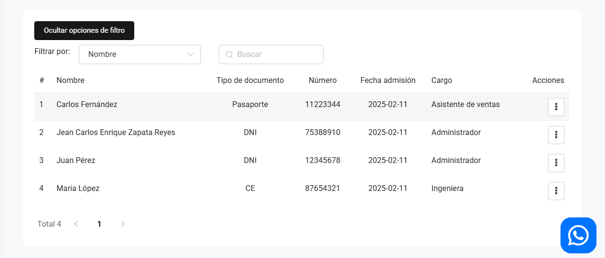

# Empleados

En este artículo te enseñaremos a crear empleados. Sigue estos pasos para realizarlo:

Ingresa al módulo de **Producción**, y luego en la subcategoría **Empleados**. En la parte superior derecha selecciona el botón **Nuevo**.

## Nuevo empleado

Aparecerá el formulario para llenar los datos del Nuevo empleado.

Se completan los siguientes campos:

- **Tipo Doc. Identidad:** Selecciona el tipo de documento de identidad.
- **Número:** Inserta el número de documento de identidad.
- **Nombre:** Inserta el nombre del nuevo empleado.
- **Fecha Nacimiento:** Selecciona la fecha de nacimiento.
- **Fecha ingreso:** Selecciona la fecha de ingreso.
- **Cargo:** Inserta el cargo del empleado
- **Dirección:** Inserta la dirección.
- **Teléfono:** Inserta el teléfono.
- **Correo electrónico:** Inserta el correo electrónico.

Seguido selecciona el botón **Guardar**. Y se verá el **Listado de Empleados**.

