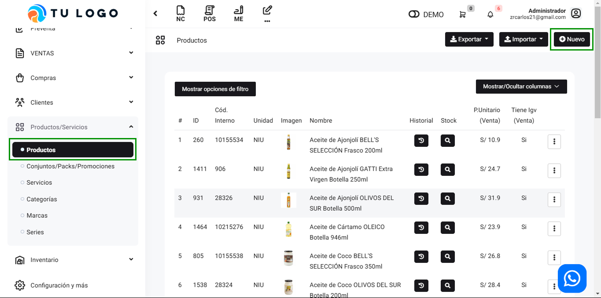
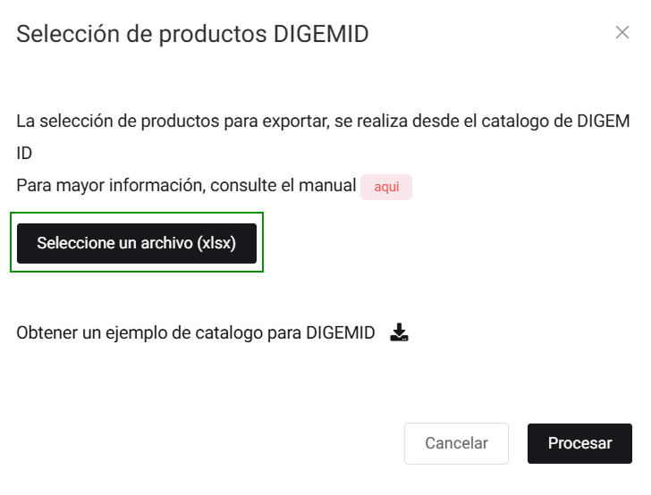
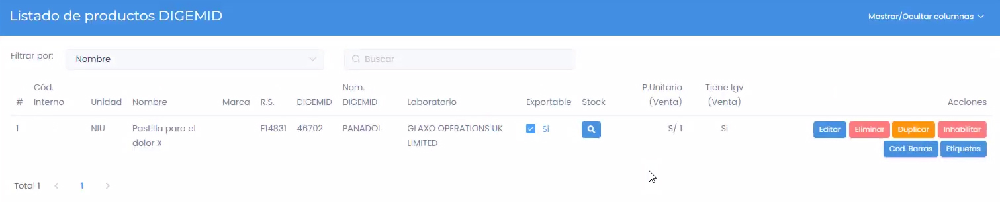

# Productos: Añadir Información de DIGEMID

En este artículo te enseñaremos a crear productos y añadir información de DIGEMID. Sigue estos pasos para realizarlo:

## Crear Producto

Ingresa al módulo **Productos**, y luego en la subcategoría **Productos**, selecciona el botón **Nuevo**.

Aparecerá el siguiente formulario:

Deberá completar los campos, como crear un producto normal, la única diferencia sería que agrega el **Código DIGEMID**.

Seguido, para validarlo ,ingresa al módulo de **Farmacia**, y luego en la subcategoría **Productos**. En la parte superior derecha seleccione **DIGEMID**.

Aparecerá la siguiente ventana emergente:

Selecciona **Obtener un ejemplo de catalogo para DIGEMID**, nos llevará a un portal, en donde tendrá que seleccionar **Catálogo de productos farmacéuticos**.

Se descargará un archivo excel, seguido deberemos subir los productos al sistema.

Selecciona el botón **Seleccione un archivo (xls)** y el botón **Procesar**.

Una vez subido el catalogo, aparecerá el producto vinculado a Farmacia.

