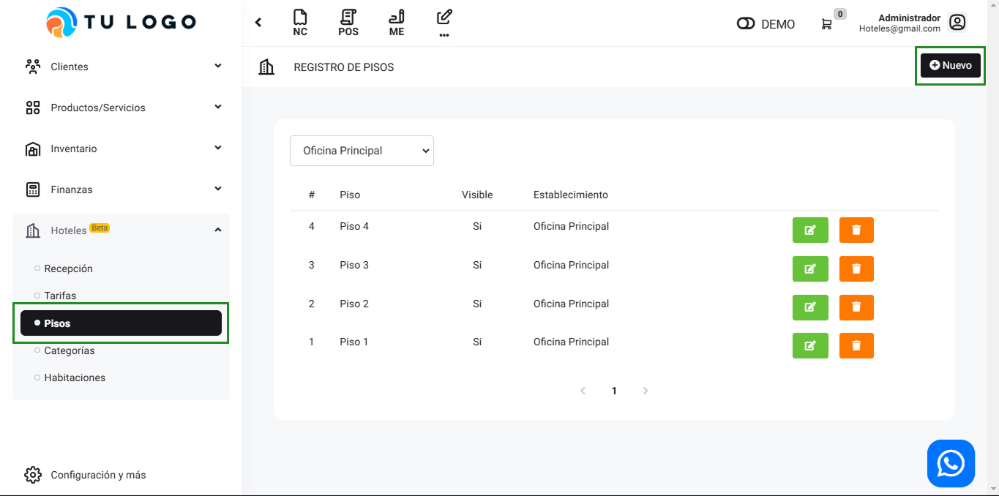
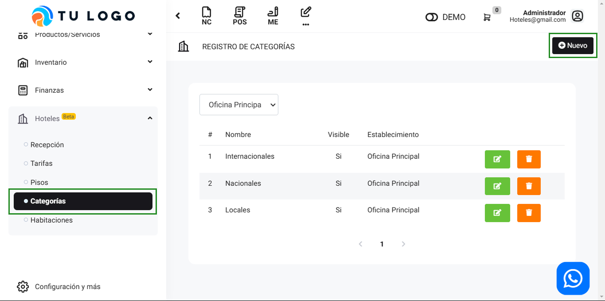
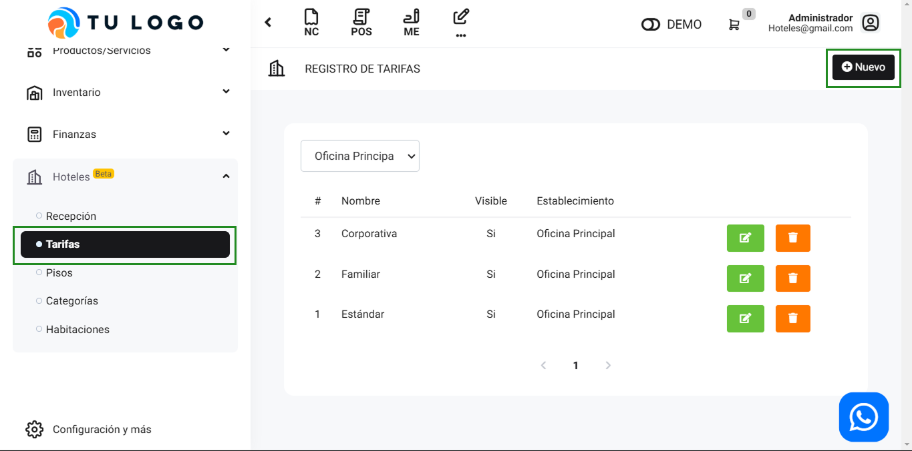
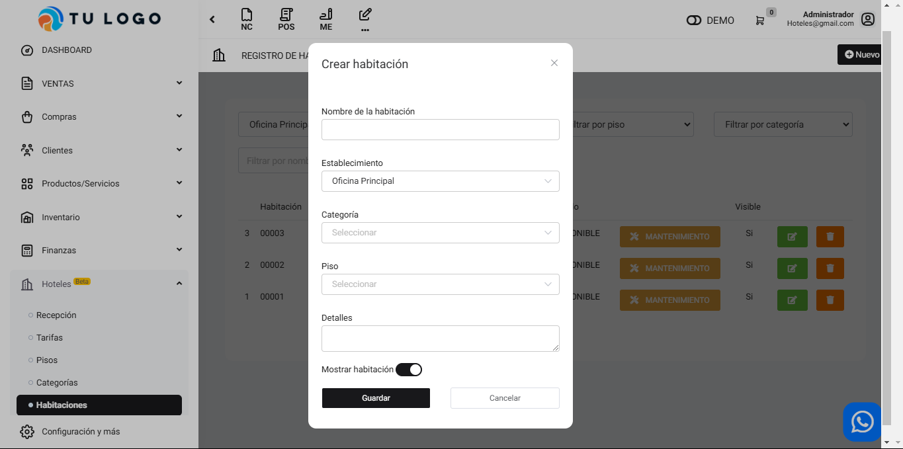

# Configuración Inicial

Para empezar a utilizar el módulo de hoteles, es necesario configurar cada elemento en el siguiente orden:

* **Pisos:** Donde indicaremos la cantidad de pisos que conforman nuestro hotel. Para agregar cada piso hacer clic en el botón “Nuevo”, completar el formulario con el nombre y si es visible, hacer clic en “Guardar”.

* **Categorías:** Aqui agregaremos los tipos de suite con las que contamos, de la misma manera que en pisos, agregaremos desde el botón nuevo.

* **Tarifas:** Las tarifas seran los diferentes precios que tendra disponible para las habitaciones, de la misma manera que en los items anteriores, agregaremos desde el botón nuevo.

* **Habitaciones:** En este apartado, agregaremos las habitaciones, asi como los precios de las tarifas previamente creadas. Para crear la habitacion nos dirigiremos a el botón nuevo y completaremos el formulario.

Además dentro de este listado encontraremos las opciones de agregar el precio de las tarifas, asi como inhabilitar las habitaciones por mantenimiento, editar la informacion o borrar la habitacion.

Si tiene dudas puede escribir un comentario o comunicarse con La central Buho para obtener más ayuda.
