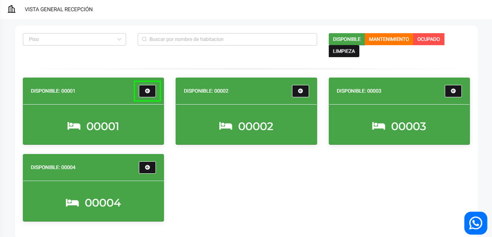
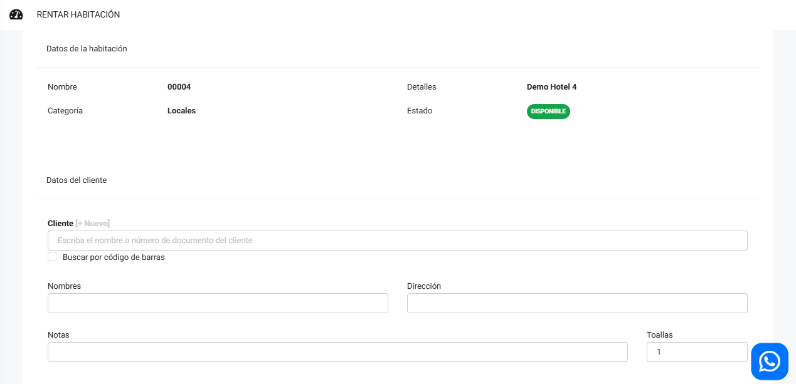
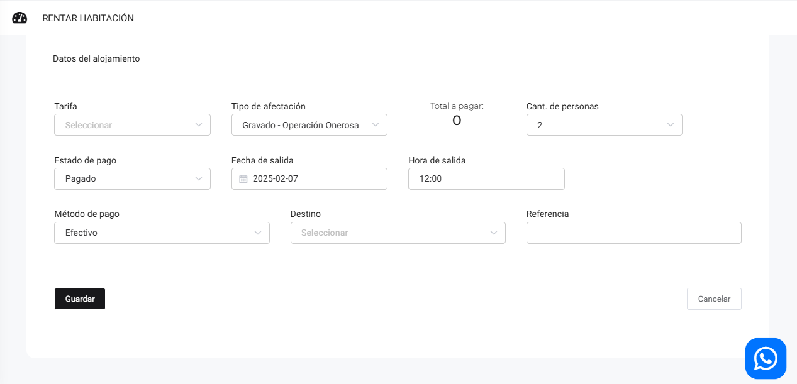
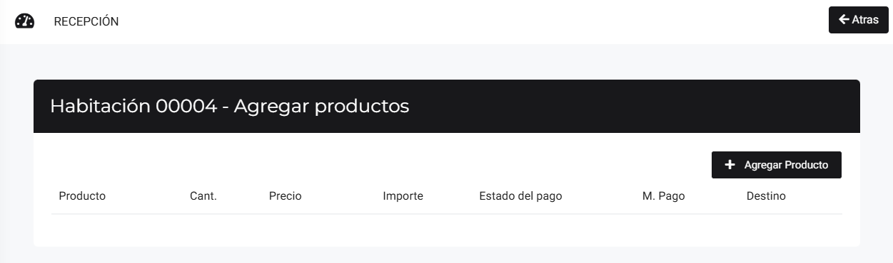
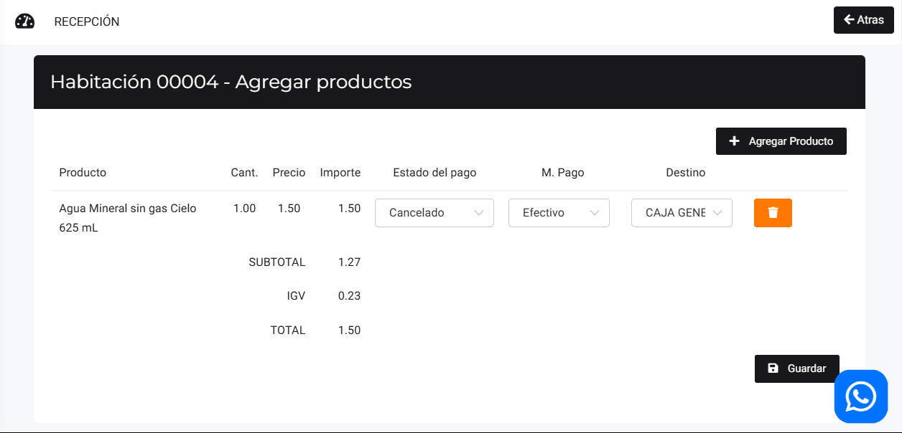
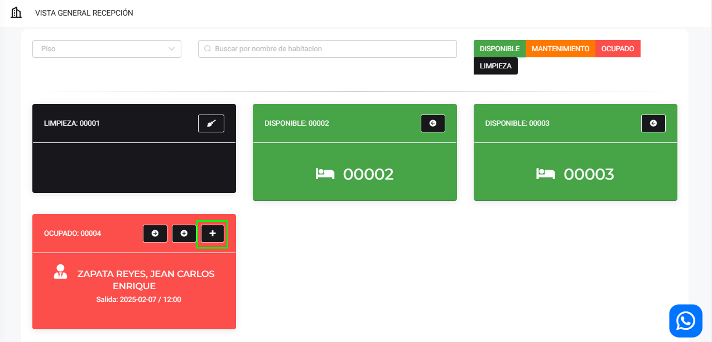

# Recepción

En este artículo te enseñaremos a manejar recepción. Sigue estos pasos para realizarlo:

Ingresa al módulo de **Hoteles** y luego selecciona la subcategoría **Recepción**. En la parte superior derecha, se pueden observar los diferentes estados de las habitaciones.

## Rentar habitación

Para rentar una habitación, selecciona el botón azul.

Aparecerá lo siguiente:

Completa:

* **Cliente:** Selecciona al cliente que ocupará la habitación, caso contrario, cree uno nuevo **[aquí](https://manual.uio.la/Pro7/modulos/Esenciales/clientes/Clientes-creacion-individual)**.
* **Tarifa:** Selecciona la tarifa correspondiente.
Selecciona el botón Guardar.

El estado de la habitación se cambia a **OCUPADO**.

## Agregar Producto

Si desea agregar algún producto selecciona el botón **"+"**.

Podrá agregar producto, seleccionando el botón **Agregar Producto**.

Seguido seleccione el producto, y selecciona el botón **Guardar**.

## Extender Tiempo 

Si el cliente desea extender su estancia, deberá seleccionar el botón **"+"**.

Podrá seleccionar el tiempo adicional y/o editar la información de la habitación del huésped.

## Retiro del huésped

Al momento de que el huésped se decide retirar, selecciona el botón azul **"Ir al checkout"**.

Aparece un resumen detallado de lo que consumió el huésped. Y se genera el comprobante electrónico.

Seguido Selecciona **Guardar y Generar Comprobante**.

Una vez realizada toda la acción, el estado de la habitación se cambia automáticamente a estado de **LIMPIEZA**. Para cambiar el estado a Disponible selecciona el botón azul.

