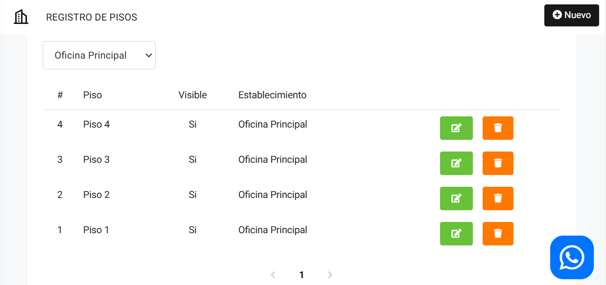

# Pisos

En este artículo te enseñaremos a como pisos. Sigue estos pasos para realizarlo:

Ingresa al módulo de **Hoteles** y luego selecciona la subcategoría **Pisos**.

## Crear pisos

En la parte superior derecha selecciona el botón **Nuevo**. Aparecerá el siguiente formulario:

Completa:

* **Nombre del piso:** Inserta el nombre del piso.
* **Mostrar piso:** Selecciona el interruptor si desea mostrar el piso.
  
Seguido selecciona el botón **Guardar**.

Se mostrará el listado de pisos:

Podrá editar el piso, seleccionando el botón verde, y eliminarla con el botón rojo.
