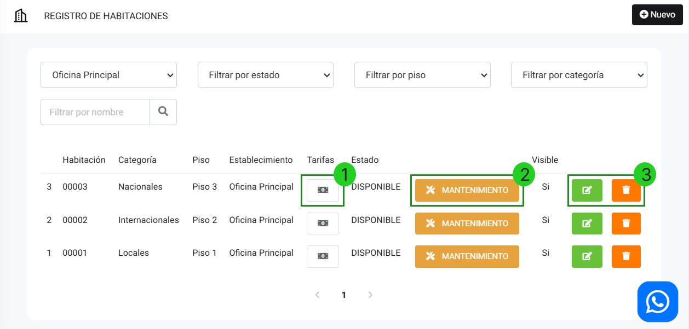

# Habitaciones

En este artículo te enseñaremos a como crear habitaciones. Sigue estos pasos para realizarlo:

Ingresa al módulo de **Hoteles** y luego selecciona la subcategoría **Habitaciones**.

## Crear habitaciones

En la parte superior derecha selecciona el botón **Nuevo**. Aparecerá el siguiente formulario:

* **Nombre de la habitación:** Inserta el nombre de la habitación.
* **Categoría:** Selecciona la categoría.
* **Piso:** Selecciona el piso de la habitación.
* **Detalles:** Inserta el detalle.

:::danger Importante
El detalle no puede tener más de 50 caracteres.
:::

* **Mostrar habitación:** Selecciona el interruptor si desea mostrar el piso.

Seguido selecciona el botón **Guardar**.

Se mostrará el listado de habitaciones:

1. **Tarifas:** Al seleccionar podrá agregar tarifas a la habitación.

2. **Mantenimiento:** Al seleccionar, la habitación se pone en Mantenimiento.

3. **Botones:**

* **Editar:** Selecciona el botón verde.
* **Eliminar:** Selecciona el botón rojo.
