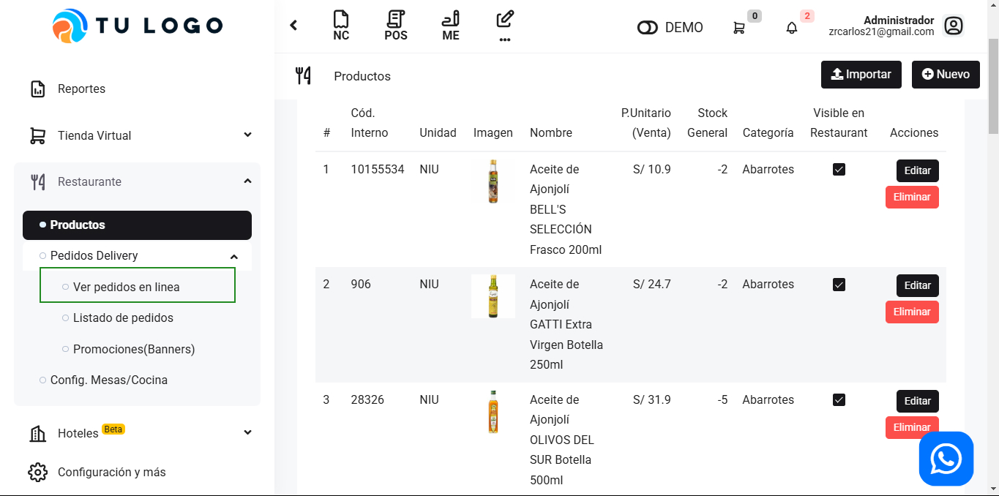
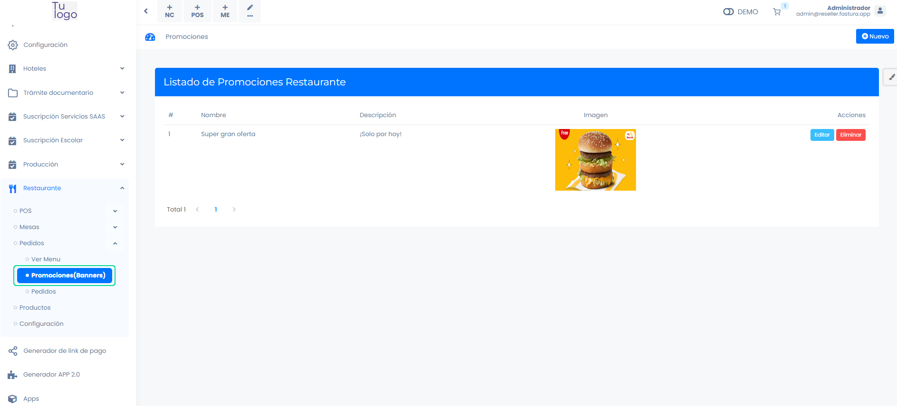

# Pedidos

En este artículo te enseñaremos a manejar los pedidos de manera online. Sigue estos pasos para realizarlo:

Ingresa al módulo de **Restaurante**, selecciona **Pedidos Delivery** y la subcategoría **Ver Pedidos en Linea.**

Al seleccionar se abrirá la web para que los clientes externos puedan realizar su pedido de manera online. El cliente se registra a la tienda virtual, añade el producto de su preferencia, rellena la información necesaria y se realiza el pedido.

El pedido aparecerá en su **Listado de Pedidos**, puede cambiar el estado del producto según lo solicitado. 

## Promociones (Banners)

En esta área podrá modificar, añadir y editar los banners que desea que aparezca en su **Tienda Virtual.**

