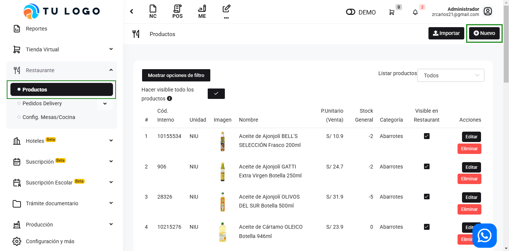
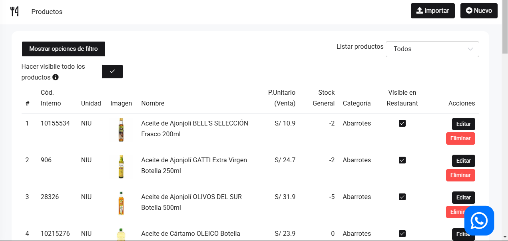

# Productos

En este artículo te enseñaremos a agregar productos. Sigue estos pasos para realizarlo:

Ingresa al módulo de **Restaurante** y luego selecciona la subcategoría **Productos**.En la parte superior derecha, selecciona el botón **Nuevo.**

## Crear productos

En la parte superior derecha, selecciona el botón **Nuevo.**

Completa los siguientes campos obligatorios:

**1. Nombre:** Ingresa el nombre del producto.
**2. Precio Unitario:** Ingresa el precio unitario.
**3. Código Interno:**  Identifica el producto, ayuda a la gestión de inventarios. Es importante colocar el código interno para que los productos puedan visualizarse en su Tienda Virtual y Restaurante. Puede 
**4. Stock Inicial:** Este apartado describe el stock inicial de productos en el módulo de restaurante. Aquí se detallan las cantidades iniciales de cada producto disponible en el inventario.
**5. Imagen:** Inserte una imagen referencial de su producto.

:::info IMPORTANTE:

Para que los productos puedan visualizarse en la app, deben contar con código interno.

:::

Después selecciona el botón **Guardar**, donde visualizará la lista de los productos.

## Lista de productos

Seleccionando la casilla de selección, decidirá que producto se mostrará en su app mozo.pe

