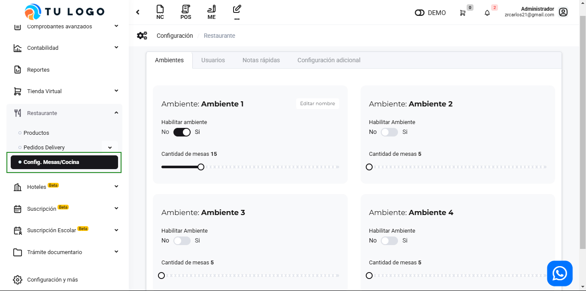
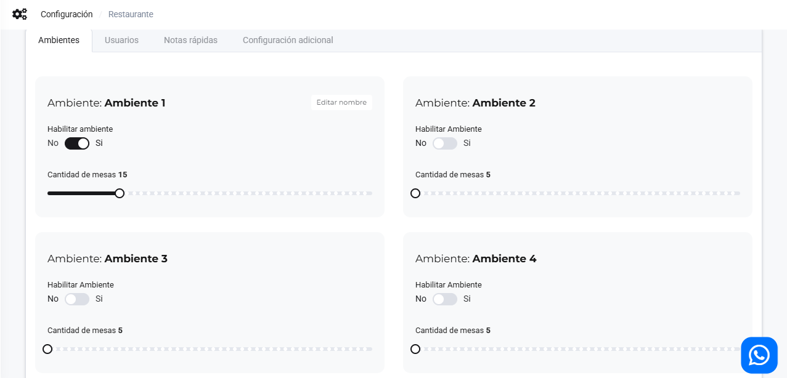
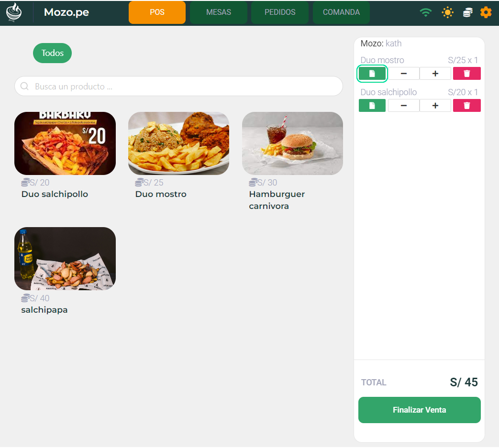

# Configuración previa  

Este artículo muestra cómo realizar la configuración inicial para utilizar la app **Mozo.pe**. Sigue estos pasos:  

Ingresa al módulo de **Restaurante** y luego selecciona **Configuración.**  

  

## Ambientes  

Configura hasta **4 ambientes** y un máximo de **50 mesas por ambiente**.  

  

### Habilitar Botones de Comanda  

En esta sección, puedes gestionar los permisos relacionados con la comanda:  

- **Enviar a comanda:** El pedido se envía a la comanda.  
- **Imprimir:** Permite enviar el pedido a impresión directamente.  
- **Imprimir y enviar a comanda:** Envía el pedido simultáneamente a la cocina y la comanda.  

### Permisos Adicionales  

Habilita permisos adicionales para mozos:  

- **Habilitar comanda para mozo:** Acceso al módulo de comanda.  
- **Habilitar POS para mozo:** Acceso al módulo POS.  

## Usuarios  

Gestiona roles y accesos de cada usuario.  

  

### Asignar un Rol  

Selecciona el usuario y elige el rol correspondiente:  

- **Administrador:** Acceso total a Mozo.pe.  
- **Caja:** Funcionalidades de caja y todos los menús.  
- **Cocina/Bar:** Acceso solo al módulo de comandas.  
- **Mozo:** Gestión de mesas.  

Haz clic en **Guardar** para aplicar los cambios.  

## Notas  

Agrega notas fácilmente.  

  

Ingresa la descripción de la nota, selecciona **Guardar**, y se mostrará en la parte inferior de la pantalla.  

  

Estas notas se pueden añadir desde las siguientes opciones:  

  

## Configuración Adicional  

En la sección de **Configuración Adicional**, puedes gestionar dos áreas clave:  

### Habilitar Botones en Comanda  

- **Solo impresora:** Permite que la impresión se realice únicamente.  
- **Solo pantalla en cocina:** Muestra la comanda en pantalla sin imprimir.  
- **Tengo impresora y pantalla en cocina:** Combina ambas opciones.  

### Permisos Adicionales para Mozos  

- **Habilitar comanda:** Permite que los mozos ingresen al módulo de comanda.  
- **Habilitar POS:** Otorga acceso al módulo POS.  

Estas configuraciones facilitan la adaptación de la app a las necesidades operativas de tu restaurante.  

