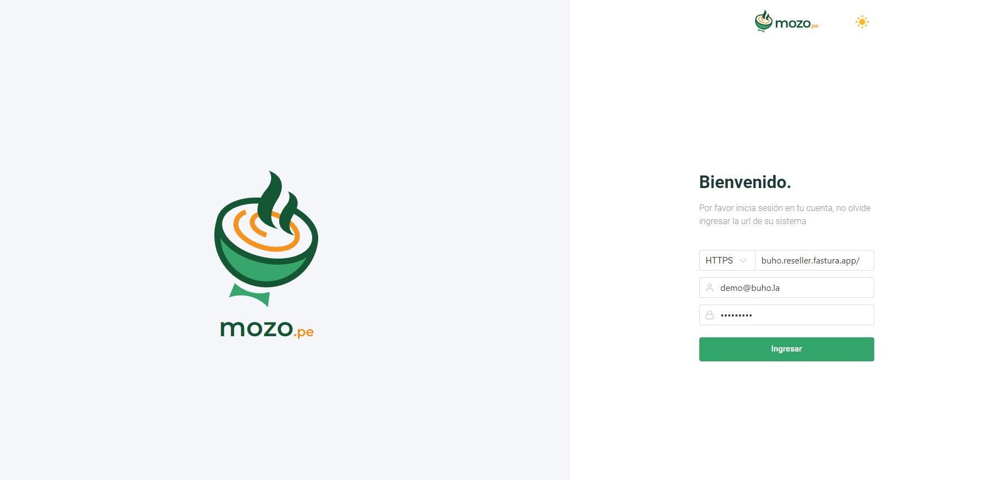
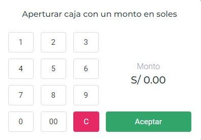
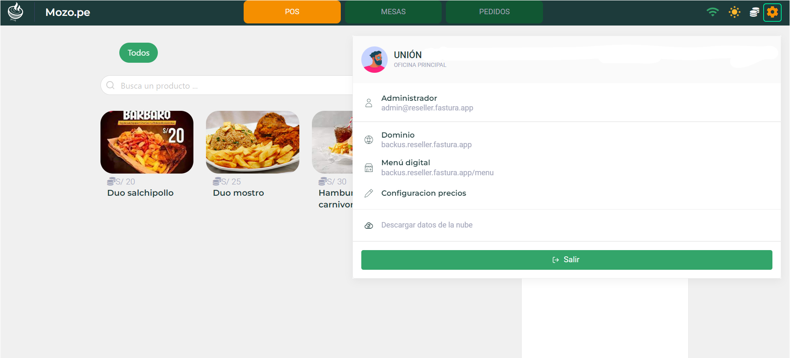
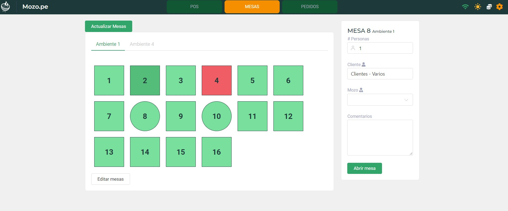
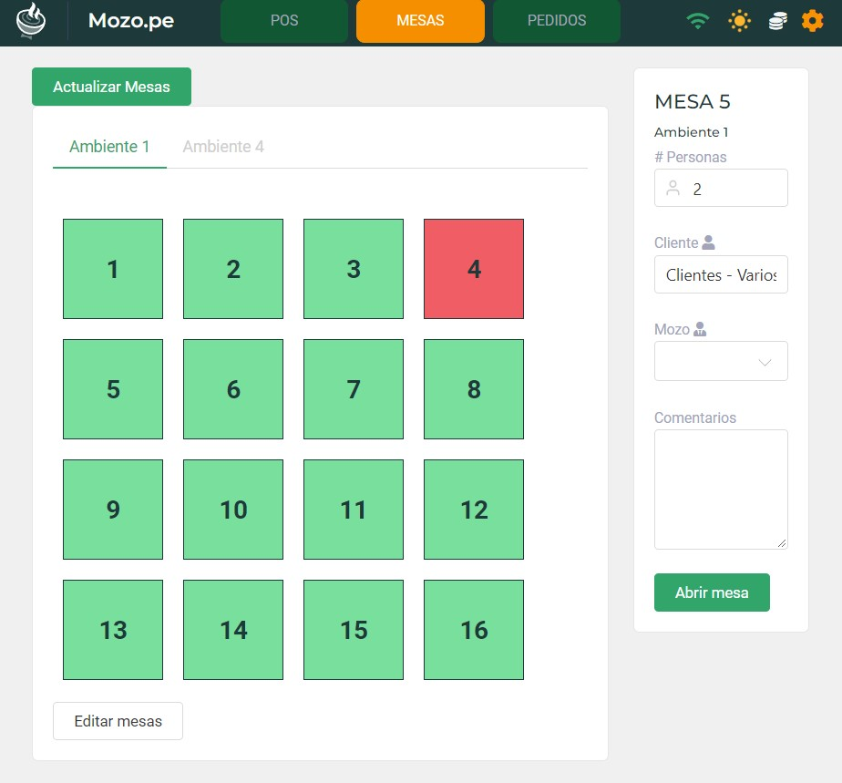
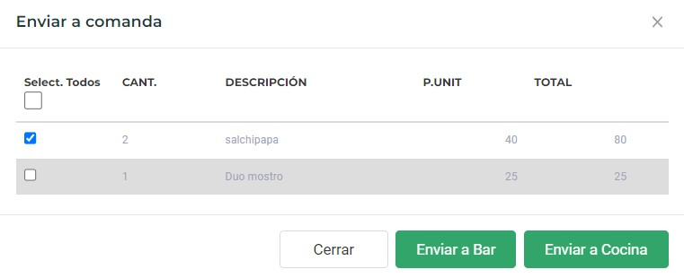

# Mozo.pe

En este artículo te enseñaremos a manejar el rubro de restaurante en el facturador, utilizando [Mozo.pe.](#) Sigue estos pasos para realizarlo:

1. Ingresa a mozo.pe con tus accesos que utilizas al entrar al sistema de facturación.

2. Abrir una caja.

3. Ajustes

* **Administrador:** Se puede observar con que usuario se ingreso al sistema.
* **Dominio:** Redirige al sistema de facturación.
* **Menú digital:** Nos da acceso al menú virtual.
* **Configurar precios:** Puede configurar los precios de los productos.
* **Descargar datos en la nube:** Sube todos los datos a la nube.

* **Abrir caja:** Te permite abrir una caja.
* **Movimientos de caja:** Te da un pequeño vistazo a los movimientos de la caja.
* **Cerrar caja y enviar a la nube:** Cierra la caja y lo sube a la nube.

También cuenta con modo nocturno.

4. **POS**, para los pedidos que se hacen en el restaurante y el pedido será para llevar. Seleccionamos los productos y selecciona el botón Finalizar Venta.

Emitir comprobante electrónico, puede seleccionar que tipo de comprobante electrónico desea emitir, selecciona el cliente.

5. Mesas, se puede editar las mesas de forma cuadrada o circular seleccionando el botón Editar mesa.

:::info importante

El estado verde es disponible y el estado rojo es ocupado.
:::

- Para realizar un pedido, seleccionamos la mesa, ingresa la cantidad de personas que estarán en la mesa, selecciona el cliente, selecciona el mozo y algún comentario si lo desea. Seguido seleccionamos el botón **Abrir mesa.**

:::

Selecciona los platillos que van a consumir, y seleccionamos enviar a comanda, según corresponda se envía a Cocina o a Bar.

Seguido nos dirigimos a Comanda:

Al seleccionar **Siguiente**, así de Recibidos se pasa a Preparando y seguido a por Entregar, después de seleccionar siguiente en entregar, significa que el pedido ya esta listo.

6. Pedido, una vez los pedidos realizados de manera online enviado a cocina, se puede visualizar el estado: en preparación, enviados, entregados.

