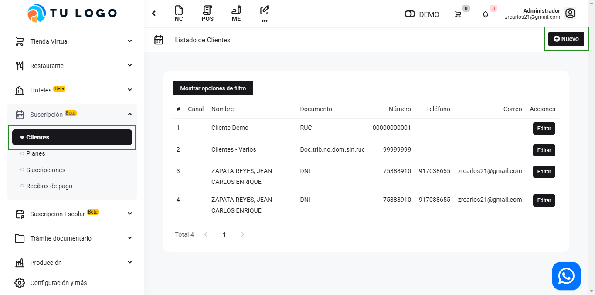

# Clientes

En este artículo te enseñaremos a crear Clientes para el módulo de Suscripción Servicios SAAS . Sigue estos pasos para realizarlo:

Ingresa al módulo de Suscripción Servicios SAAS, y luego la subcategoría Clientes. En la parte superior derecha selecciona el botón Nuevo.

Completa los siguientes campos con los datos del nuevo cliente:

- **Tipo Doc. Identidad:** Selecciona el tipo de documento de identidad.
- **Número:** Ingresa el número que corresponde al tipo de documento Identidad. Después selecciona el botón SUNAT, para que se autocomplete el nombre y la dirección.
- **Nombre:** Se autocompletará el nombre que corresponde al tipo de documento Identidad.
- **Código interno:** Ingresa el código del cliente.
- **Nombre Comercial:** Inserta el nombre comercial.

Seguido seleccione el botón **Guardar**.

:::danger IMPORTANTE:

El cliente se podrá visualizar en el módulo **Clientes**, la subcategoría **clientes**.
:::
