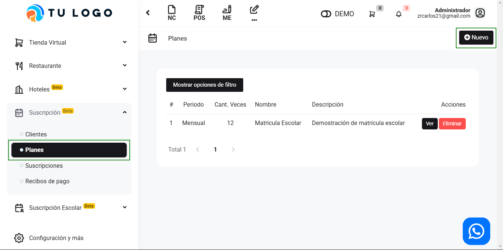
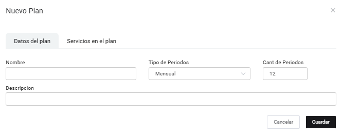
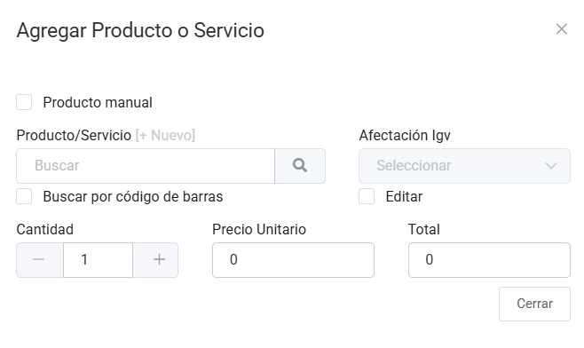

# Planes

En esta área te ayudaremos a cómo crear planes para la suscripción de servicios. Sigue estos pasos para realizarlo:

Ingresa al módulo de **Suscripción Servicios SAAS** y luego selecciona subcategoría **Planes**. En la parte superior derecha selecciona el botón **Nuevo**.

Completa los siguientes campos:

- **Nombre:** Inserta el nombre del nuevo plan.
- **Tipo de Periodos:** Selecciona el tipo de periodos: Mensual o Anual.
- **Cantidad de periodos:** Inserta la cantidad de periodos.
- **Descripción:** Inserta una pequeña descripción del plan.

:::danger IMPORTANTE:

Es obligatorio agregar productos.
:::

Agrega servicios al plan:

Al seleccionar **Agregar Productos**, podrá agregar los productos correspondientes para el nuevo plan.

- **Producto/Servicio:** Selecciona el producto creado previamente, si aún no lo creo selecciona **+Nuevo** y  sigue los pasos en este artículo.
- **Cantidad:** Ingresa la cantidad del producto.

Seguido selecciona el botón **Guardar**.
