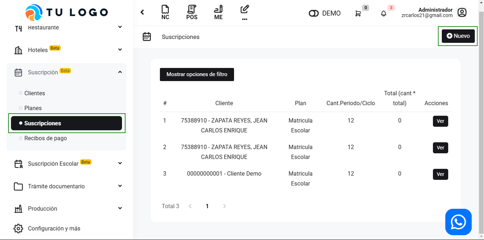

# Suscripciones

En esta área te ayudaremos a cómo ingresar suscripciones. Sigue estos pasos para realizarlo:

Ingresa al módulo de **Suscripción Servicios SAAS** y luego selecciona subcategoría Suscripciones En la parte superior derecha selecciona el botón **Nuevo**.

Completa lo siguiente:

- **Cliente:** Selecciona el cliente.
- **Seleccione el plan:** Selecciona el plan creado previamente. Si aún no lo creo, puede realizarlo aquí.
- **Fecha de primer pago:** Selecciona la fecha del primer pago.

Seguido selecciona el botón **Guardar**. Y podrá visualizar la suscripción creada en el Listado de suscripciones.
