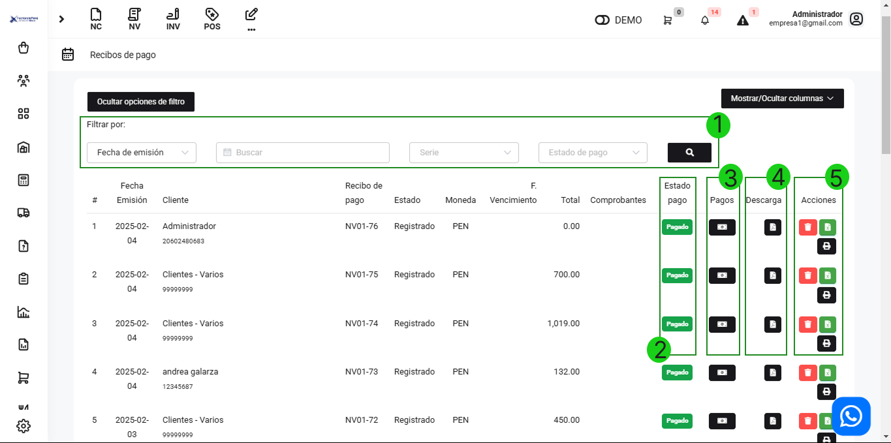
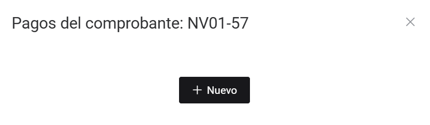

# Recibos de Pago

En este artículo te ayudaremos a manejar tus recibos de pago de suscripciones .Sigue estos pasos para realizarlo:

Ingresa al módulo de **Suscripción Servicios SAAS** y luego selecciona **Recibos de pago.**

Botones de acción

**1. Filtrar por:**

Para encontrar los comprobantes electrónicos de manera más rápida. Se puede filtrar por fecha de emisión o cliente.

**2. Estado pago:**

Muestra el estado actual del comprobante electrónico.

**3. Pagos:**

Al seleccionar, puede agregar pagos.

Seguido, selecciona el botón **Nuevo**. Completa:

- **Método de pago:** Selecciona el método de pago.
- **Destino:** Selecciona el destino.
- **Referencia:** Si desea puede ingresar una referencia.
- **Archivo:** Es opcional, puede subir una foto del pago realizado.
- **Monto:** Ingresa el monto del pago.

Seguido selecciona el icono del check, y el pago se registrará el pago.

**4. Descarga:**

Seleccionando este botón descarga la nota de venta generada.

**5. Acciones:**

- **Anular:** Con el primer botón rojo con icono de tacho de basura, va a poder anular la nota de venta.
- **Generar** comprobante: Al seleccionar este botón podrá generar una boleta.
- **Imprimir:** Al seleccionar este botón podrá escoger en que formato podrá imprimir el comprobante.
