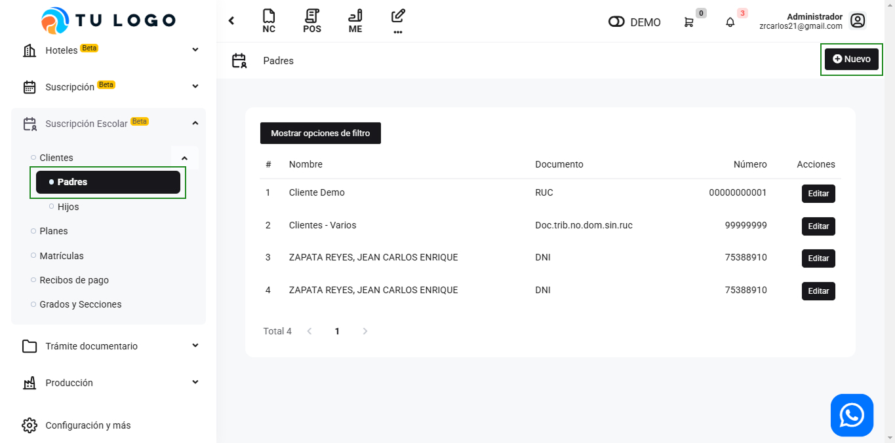

# Clientes: Padres e hijos

En este artículo te enseñaremos a crear Clientes: Padres para el módulo de Suscripción Escolar. Sigue estos pasos para realizarlo:

Ingresa al módulo de **Suscripción Escolar**, y luego la subcategoría **Clientes** y luego selecciona **Padres**. En la parte superior derecha selecciona el botón **Nuevo**.

Completa los siguientes campos con los datos del padre :

* **Tipo Doc. Identidad:** Selecciona el tipo de documento de identidad.
* **Número:** Ingresa el número que corresponde al tipo de documento Identidad. Después selecciona el botón SUNAT, para que se autocomplete el nombre y la dirección.
* **Nombre:** Se autocompletará el nombre que corresponde al tipo de documento Identidad.
* **Código interno:** Ingresa el código del cliente.

Tendrá que rellenar los datos del hijo desde esta ventana emergente:

Selecciona el botón **Agregar Hijo**:

* **Tipo Doc. Identidad:** Selecciona el tipo de documento de identidad.
* **Número:** Ingresa el número que corresponde al tipo de documento Identidad. Después selecciona el botón SUNAT, para que se autocomplete el nombre y la dirección.
* **Nombre:** Se autocompletará el nombre que corresponde al tipo de documento Identidad.
* **Código interno:** Ingresa el código del hijo.

Seguido selecciona el botón **Guardar**. Y se guardará los datos del padre e hijo.

:::info importante

No se puede crear hijos de manera individual.

:::
